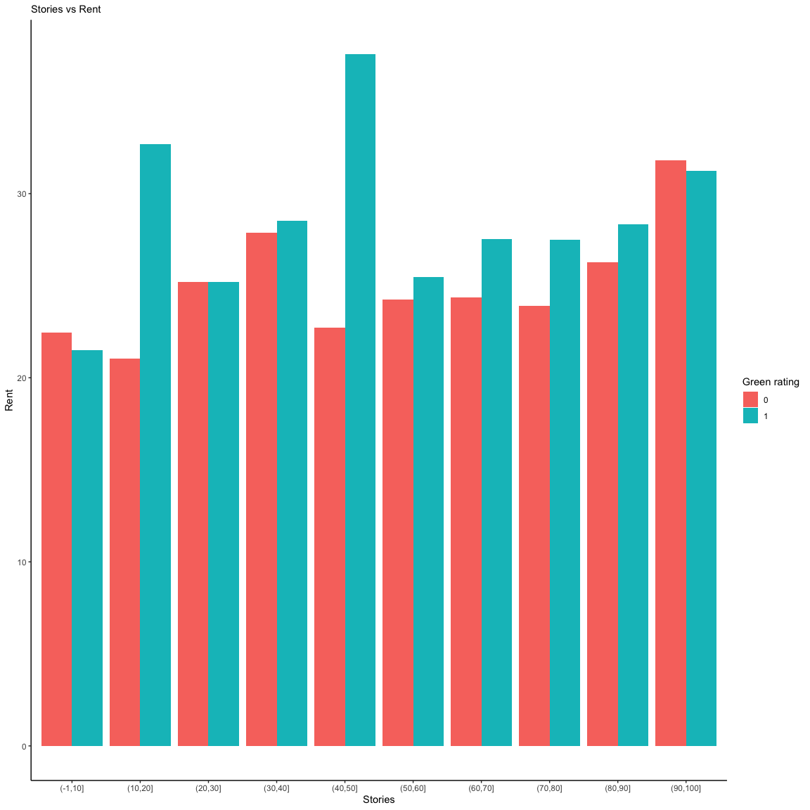
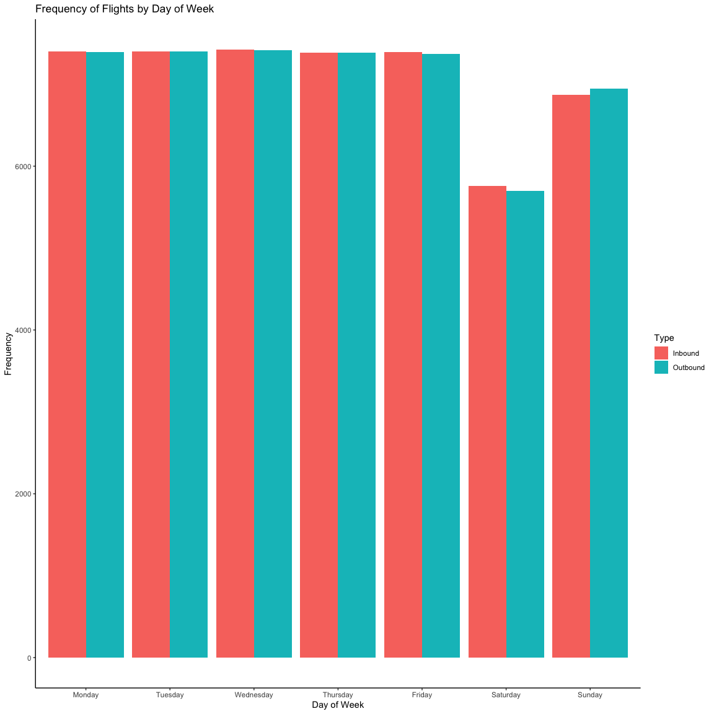
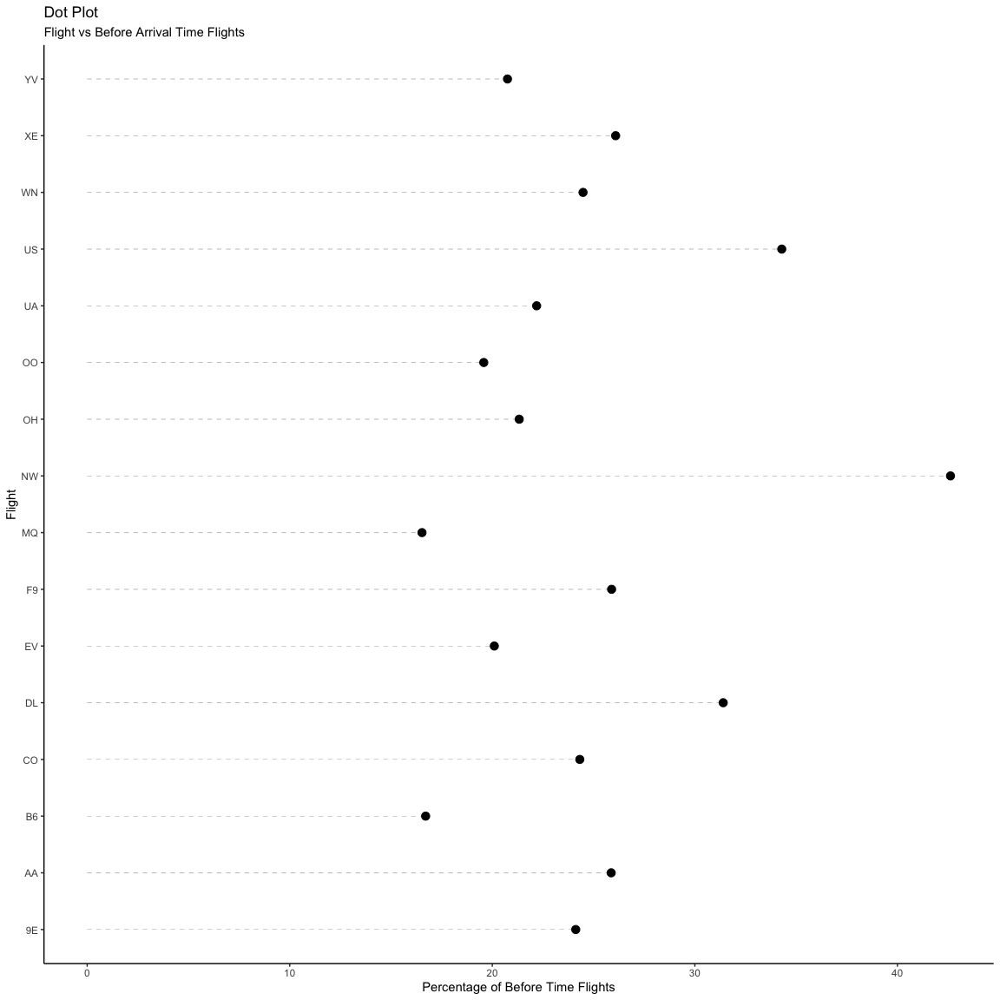
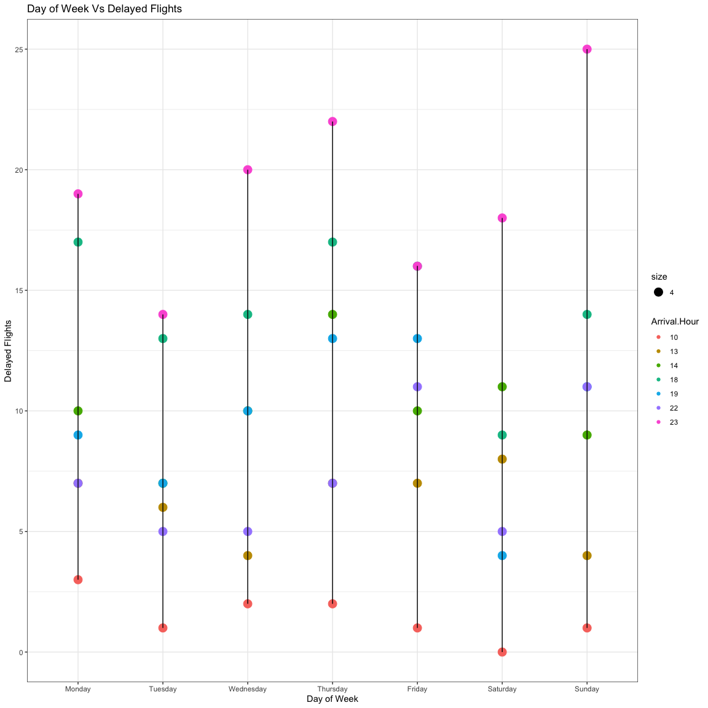

STA380 Exercise
================
Apoorva Jasti, Arnav Deshwal, Palakh Gupta, and Tushar Gupta
8/18/2019

 

<h2>

Green Buildings

</h2>

<h3>

Goal

</h3>

The goal is to supoort or counter conclusions of real
estate developer’s on staff stats guru with evidence.

<h3>

Data Exploration and Analysis

</h3>

    ##  [1] "CS_PropertyID"     "cluster"           "size"             
    ##  [4] "empl_gr"           "Rent"              "leasing_rate"     
    ##  [7] "stories"           "age"               "renovated"        
    ## [10] "class_a"           "class_b"           "LEED"             
    ## [13] "Energystar"        "green_rating"      "net"              
    ## [16] "amenities"         "cd_total_07"       "hd_total07"       
    ## [19] "total_dd_07"       "Precipitation"     "Gas_Costs"        
    ## [22] "Electricity_Costs" "cluster_rent"

    ## [1] "Number of green buildings"

    ## [1] 685

    ## [1] "Number of non-green buildings"

    ## [1] 7209

    ## [1] "Summary of rent for green buildings"

    ##    Min. 1st Qu.  Median    Mean 3rd Qu.    Max. 
    ##    8.87   21.50   27.60   30.02   35.50  138.07

    ## [1] "Summary of rent for non-green buildings"

    ##    Min. 1st Qu.  Median    Mean 3rd Qu.    Max. 
    ##    2.98   19.18   25.00   28.27   34.00  250.00

    ## [1] "Summary of leasing rate for green buildings"

    ##    Min. 1st Qu.  Median    Mean 3rd Qu.    Max. 
    ##    0.00   85.40   92.92   89.28   97.70  100.00

    ## [1] "Summary of rent for non-green buildings"

    ##    Min. 1st Qu.  Median    Mean 3rd Qu.    Max. 
    ##    0.00   77.05   89.17   81.97   96.28  100.00

    ## [1] "Green buildings with amenities"

    ## [1] 72.70073

    ## [1] "non-green buildings with amenities"

    ## [1] 50.756

    ## [1] "Percentage of green buildings in each class"

<table>

<thead>

<tr>

<th style="text-align:left;">

Var1

</th>

<th style="text-align:right;">

Freq

</th>

</tr>

</thead>

<tbody>

<tr>

<td style="text-align:left;">

A

</td>

<td style="text-align:right;">

79.708029

</td>

</tr>

<tr>

<td style="text-align:left;">

B

</td>

<td style="text-align:right;">

19.270073

</td>

</tr>

<tr>

<td style="text-align:left;">

C

</td>

<td style="text-align:right;">

1.021898

</td>

</tr>

</tbody>

</table>

    ## [1] "Percentage of non-green buildings in each class"

<table>

<thead>

<tr>

<th style="text-align:left;">

Var1

</th>

<th style="text-align:right;">

Freq

</th>

</tr>

</thead>

<tbody>

<tr>

<td style="text-align:left;">

A

</td>

<td style="text-align:right;">

36.21862

</td>

</tr>

<tr>

<td style="text-align:left;">

B

</td>

<td style="text-align:right;">

48.48107

</td>

</tr>

<tr>

<td style="text-align:left;">

C

</td>

<td style="text-align:right;">

15.30032

</td>

</tr>

</tbody>

</table>

For our research on the dataset, we first looked at how
the variables differ between green and non-green buildings. Looking at
the summary of the rent and leasing rate, we can see that the rent is
$2.6(median rent) higher for green buildings and the leasing rate is
~15% higher for green buildings. Looking at the amenities, we can see
that ~3/4th of the green buildings have amenities. From the classes, we
can see that green buildings mostly belong to class A while non-green
buildings are split across
    classes.

    ## [1] "Number of buildings with less than 10% occupancy rate"

    ## [1] 215

    ## [1] "Number of green buildings  with less than 10% occupancy rate"

    ## [1] 1

    ## [1] "Summary of rent for high occupancy green buildings"

    ##    Min. 1st Qu.  Median    Mean 3rd Qu.    Max. 
    ##    8.87   21.50   27.60   30.03   35.54  138.07

    ## [1] "SUmmary of rent for high occupancy non-green buildings"

    ##    Min. 1st Qu.  Median    Mean 3rd Qu.    Max. 
    ##    2.98   19.43   25.03   28.44   34.18  250.00

    ## [1] "Summary for green buildings with 15 stories"

    ##    Min. 1st Qu.  Median    Mean 3rd Qu.    Max. 
    ##   95490  235025  262086  291091  334206  700756

We then looked into calculating the median rent and
looking into hypothesis the ‘excel guru’ had. We looked at the rents of
green and non-green building with and without the low occupany (\<10%)
rates, as we can see from the data there is no difference in the mean
and median rent. Thus, the median difference of the rents between green
and non-green buildings is similar($2.6). We then looked at the size of
the 15-story building that the client wanted to build. Looking at the
size vs stories, we can say that for the 15-story building, the median
size is 266087. The size and stories are positively correlated. This
would result into a higher extra revenue per year than predicted by the
‘excel guru’.

    ## [1] "Summary of multiple linear regression for response rent"

    ## 
    ## Call:
    ## lm(formula = Rent ~ ., data = buildings)
    ## 
    ## Residuals:
    ##     Min      1Q  Median      3Q     Max 
    ## -53.753  -3.581  -0.526   2.491 173.916 
    ## 
    ## Coefficients: (3 not defined because of singularities)
    ##                     Estimate Std. Error t value Pr(>|t|)    
    ## (Intercept)       -8.315e+00  1.018e+00  -8.167 3.67e-16 ***
    ## CS_PropertyID      2.959e-07  1.574e-07   1.879 0.060241 .  
    ## cluster            7.532e-04  2.840e-04   2.653 0.008006 ** 
    ## size               6.741e-06  6.561e-07  10.276  < 2e-16 ***
    ## empl_gr            6.450e-02  1.700e-02   3.794 0.000149 ***
    ## leasing_rate       9.454e-03  5.332e-03   1.773 0.076247 .  
    ## stories           -3.472e-02  1.617e-02  -2.147 0.031823 *  
    ## age               -1.249e-02  4.717e-03  -2.649 0.008096 ** 
    ## renovated         -1.425e-01  2.586e-01  -0.551 0.581681    
    ## class_a            2.872e+00  4.377e-01   6.563 5.63e-11 ***
    ## class_b            1.186e+00  3.427e-01   3.462 0.000539 ***
    ## LEED               1.877e+00  3.582e+00   0.524 0.600318    
    ## Energystar        -2.127e-01  3.818e+00  -0.056 0.955572    
    ## green_rating       6.969e-01  3.839e+00   0.182 0.855929    
    ## net               -2.559e+00  5.929e-01  -4.316 1.61e-05 ***
    ## amenities          6.703e-01  2.519e-01   2.661 0.007802 ** 
    ## cd_total_07       -1.248e-04  1.464e-04  -0.852 0.394005    
    ## hd_total07         5.354e-04  8.972e-05   5.967 2.52e-09 ***
    ## total_dd_07               NA         NA      NA       NA    
    ## Precipitation      4.830e-02  1.611e-02   2.997 0.002735 ** 
    ## Gas_Costs         -3.559e+02  7.842e+01  -4.538 5.76e-06 ***
    ## Electricity_Costs  1.886e+02  2.493e+01   7.563 4.38e-14 ***
    ## cluster_rent       1.008e+00  1.421e-02  70.949  < 2e-16 ***
    ## classB                    NA         NA      NA       NA    
    ## classC                    NA         NA      NA       NA    
    ## ---
    ## Signif. codes:  0 '***' 0.001 '**' 0.01 '*' 0.05 '.' 0.1 ' ' 1
    ## 
    ## Residual standard error: 9.413 on 7798 degrees of freedom
    ##   (74 observations deleted due to missingness)
    ## Multiple R-squared:  0.6126, Adjusted R-squared:  0.6116 
    ## F-statistic: 587.2 on 21 and 7798 DF,  p-value: < 2.2e-16

After this we looked into how the other variables
affected the rent of green vs non-green buildings. We first looked at
the multiple linear regression. From the MLR summary, We can see that
size, empl\_gr, stories, age, class, net, amenities, hd\_total07,
precipitation, gas\_costs, electricity\_costs and cluster rent
significantly affect the rent of the building. 

Variables such as empl\_gr, hd\_total07, precipitation,
gas\_costs, electricity\_costs and cluster rent are all cluster
dependent and hence same for green and non-green buildings. We can see
the same from the cluster rent vs electicity cost graph. We need to look
into these variables when looking at which cluster to build this
building but not to decide if the building should be green or
not.

We have already looked into the size based on the given
height of the building. We will now look into the effect of the age,
class, net and amenities on the rent of green buildings vs non-green
buildings.

Looking at the affect of rent on ‘net contract’ basis, we
can see that green-buildings not having net contract cost USD 6/square
feet more compared to those that don’t have it and $2/square feet more
for non-green buildings having net contract. The rent of green-buildings
irrespective of amenities is same but non-green buildings without
amenities is cheaper by USD 2/square feet. From the age graph, we can
see that green buildings have a higher rent after 10 years and their is
a bigger difference at 75 years(but not stat. significance.). Hence, age
might not be a huge differentiator for green vs non-green buildings for
the first 50years. From the class graph, we can see that there is a
difference of USD 1.5/square feet for class A and a difference of USD
5/square feet of Class C.

<h3>

Conclusion

</h3>

Taking the expected baseline construction costs to be USD
100 million, with a 5% expected premium for green certification, we
should expect to spend an extra USD 5 million on the green building.
Based on the extra revenue we would make, we would recuperate these
costs in USD 5000000/690000 = 7.25 years. Even if our occupancy rate
were only 90%, we would still recuperate the costs in a little over 7.5
years. Thus from year 8 onwards, we would be making atleast an extra USD
620,000 per year in profit assuming atleast 90% occupancy rate. Since
the building will be earning rents for 30 years or more, it seems like a
good financial move to build the green building with the given
data.   Thus, from the different analyses we did we can say that
the hypotheis ‘excel guru’ used to conclude the rent is not accurate. We
need more details such as the location of the house (cluster) and
details on the class, net and amenities of the building. We can use
these details to estimate the accurate rent and as well as the
additional cost we might incur to build the building. 

 

<h2>

Flights of ABIA

</h2>

<h3>

Goal

</h3>

The goal is to create a figure, or set of related
figures, that tell an interesting story about flights into and out of
Austin. You can annotate the figure and briefly describe it, but strive
to make it as stand-alone as possible.

<h3>

Frequency of Flights

</h3>

    ## # A tibble: 24 x 3
    ## # Groups:   Month [12]
    ##    Month bound        n
    ##    <fct> <chr>    <int>
    ##  1 01    Inbound   4365
    ##  2 01    Outbound  4361
    ##  3 02    Inbound   4079
    ##  4 02    Outbound  4077
    ##  5 03    Inbound   4462
    ##  6 03    Outbound  4459
    ##  7 04    Inbound   4229
    ##  8 04    Outbound  4229
    ##  9 05    Inbound   4514
    ## 10 05    Outbound  4507
    ## # … with 14 more rows

It is observed that on an average, number of flights
flying from and to Austin are relatively
equal.

It can also be observed that very less flights fly on
Saturday relative to other days and again the inbound and outbound
flights are same.

<h3>

Spring
Story

</h3>

We notice that for Spring and Summer, the delay is really
high compares to Fall and Winter. Let’s try to focus more on them to try
and understand what could be the reason behind this.  It could be
that they have a few bad days or something else.  Let’s try to
evaluate this hypothesis.  First let’s focus on Spring for incoming
and outgoing
flights

We can reject the hypothesis that it could be one day
creating the huge gap. The whole spring season has an average 6-7% delay
in flights daily.  After a similar analysis we can say that the
summer months follow the same trend.  Now let’s try to look in a
more brief manner as how to does days spread over delays on the basis of
seasons

    ## [1] "season"    "DayOfWeek" "n"

    ##  [1] "Year"              "Month"             "DayofMonth"       
    ##  [4] "DayOfWeek"         "DepTime"           "CRSDepTime"       
    ##  [7] "ArrTime"           "CRSArrTime"        "UniqueCarrier"    
    ## [10] "FlightNum"         "TailNum"           "ActualElapsedTime"
    ## [13] "CRSElapsedTime"    "AirTime"           "ArrDelay"         
    ## [16] "DepDelay"          "Origin"            "Dest"             
    ## [19] "Distance"          "TaxiIn"            "TaxiOut"          
    ## [22] "Cancelled"         "CancellationCode"  "Diverted"         
    ## [25] "CarrierDelay"      "WeatherDelay"      "NASDelay"         
    ## [28] "SecurityDelay"     "LateAircraftDelay" "DepHour"          
    ## [31] "DepMin"            "Date"              "Arrival Minutes"  
    ## [34] "Arrival Hour"      "season"            "monthname"        
    ## [37] "weekday"           "TypeofDelay"       "inbound"          
    ## [40] "outbound"

    ##    season DayOfWeek         n 
    ##  "factor"  "factor" "integer"

    ##    season DayOfWeek      Freq 
    ##  "factor"  "factor" "integer"

We can again see that Spring and Summer mosty are red
with higher delay percentages. 

After a more thorough research, we were able to dig the reason for this
- 

Summer Storms 

Austin experiences summer storms in the months of spring and summer and
in 2008, around 70% of the total summer storms in that year took place
during the spring and summer months.  This is why we see a stark
difference between number of delayed flights in Spring and Summer when
compared with Fall and Winter. 

<h3>

Carrier Efficiency

</h3>

Let’s try to understand the airlines now and their
efficiency

    ##  [1] 9E AA YV NW CO XE B6 WN UA OO OH EV US MQ F9 DL
    ## Levels: 9E AA B6 CO DL EV F9 MQ NW OH OO UA US WN XE YV

    ##     UniqueCarrier        TypeofDelay    n  Freq
    ## 1              9E                  0  307  1273
    ## 2              9E      Carrier Delay   10  1273
    ## 3              9E      Early Arrival  731  1273
    ## 4              9E LateAircraft Delay   91  1273
    ## 5              9E           NASDelay   87  1273
    ## 6              9E           No Delay   19  1273
    ## 7              AA                  0 2586  9997
    ## 8              AA      Carrier Delay  130  9997
    ## 9              AA      Early Arrival 5058  9997
    ## 10             AA LateAircraft Delay 1053  9997
    ## 11             AA           NASDelay  641  9997
    ## 12             AA           No Delay  231  9997
    ## 13             AA      Weather Delay   10  9997
    ## 14             B6                  0  401  2400
    ## 15             B6      Carrier Delay   26  2400
    ## 16             B6      Early Arrival 1435  2400
    ## 17             B6 LateAircraft Delay  305  2400
    ## 18             B6           NASDelay  173  2400
    ## 19             B6           No Delay   27  2400
    ## 20             CO                  0 1122  4614
    ## 21             CO      Carrier Delay   51  4614
    ## 22             CO      Early Arrival 2398  4614
    ## 23             CO LateAircraft Delay  300  4614
    ## 24             CO           NASDelay  565  4614
    ## 25             CO           No Delay  115  4614
    ## 26             CO     Security Delay    3  4614
    ## 27             DL                  0  335  1067
    ## 28             DL      Carrier Delay   13  1067
    ## 29             DL      Early Arrival  416  1067
    ## 30             DL LateAircraft Delay  132  1067
    ## 31             DL           NASDelay  133  1067
    ## 32             DL           No Delay   26  1067
    ## 33             DL      Weather Delay    1  1067
    ## 34             EV                  0   83   413
    ## 35             EV      Carrier Delay   26   413
    ## 36             EV      Early Arrival  213   413
    ## 37             EV LateAircraft Delay   16   413
    ## 38             EV           NASDelay   52   413
    ## 39             EV           No Delay    9   413
    ## 40             EV      Weather Delay    8   413
    ## 41             F9                  0  276  1066
    ## 42             F9      Carrier Delay    8  1066
    ## 43             F9      Early Arrival  631  1066
    ## 44             F9 LateAircraft Delay   74  1066
    ## 45             F9           NASDelay   53  1066
    ## 46             F9           No Delay   22  1066
    ## 47             MQ                  0  220  1331
    ## 48             MQ      Carrier Delay    3  1331
    ## 49             MQ      Early Arrival  762  1331
    ## 50             MQ LateAircraft Delay  215  1331
    ## 51             MQ           NASDelay   13  1331
    ## 52             MQ           No Delay   31  1331
    ## 53             MQ      Weather Delay    1  1331
    ## 54             NW                  0   26    61
    ## 55             NW      Carrier Delay    1    61
    ## 56             NW      Early Arrival   19    61
    ## 57             NW LateAircraft Delay    5    61
    ## 58             NW           NASDelay    6    61
    ## 59             NW           No Delay    3    61
    ## 60             NW      Weather Delay    1    61
    ## 61             OH                  0  318  1491
    ## 62             OH      Carrier Delay   56  1491
    ## 63             OH      Early Arrival  463  1491
    ## 64             OH LateAircraft Delay   13  1491
    ## 65             OH           NASDelay  274  1491
    ## 66             OH           No Delay  309  1491
    ## 67             OH     Security Delay    1  1491
    ## 68             OH      Weather Delay   29  1491
    ## 69             OO                  0  393  2007
    ## 70             OO      Carrier Delay   57  2007
    ## 71             OO      Early Arrival 1168  2007
    ## 72             OO LateAircraft Delay  125  2007
    ## 73             OO           NASDelay  132  2007
    ## 74             OO           No Delay   95  2007
    ## 75             OO      Weather Delay    6  2007
    ## 76             UA                  0  207   933
    ## 77             UA      Carrier Delay   16   933
    ## 78             UA      Early Arrival  538   933
    ## 79             UA LateAircraft Delay   61   933
    ## 80             UA           NASDelay   86   933
    ## 81             UA           No Delay   15   933
    ## 82             US                  0  250   729
    ## 83             US      Carrier Delay   19   729
    ## 84             US      Early Arrival  357   729
    ## 85             US LateAircraft Delay    9   729
    ## 86             US           NASDelay   71   729
    ## 87             US           No Delay   21   729
    ## 88             WN                  0 4269 17438
    ## 89             WN      Carrier Delay  170 17438
    ## 90             WN      Early Arrival 9741 17438
    ## 91             WN LateAircraft Delay 2269 17438
    ## 92             WN           NASDelay  340 17438
    ## 93             WN           No Delay  531 17438
    ## 94             WN     Security Delay    2 17438
    ## 95             WN      Weather Delay   21 17438
    ## 96             XE                  0  602  2307
    ## 97             XE      Carrier Delay   63  2307
    ## 98             XE      Early Arrival 1240  2307
    ## 99             XE LateAircraft Delay  180  2307
    ## 100            XE           NASDelay  136  2307
    ## 101            XE           No Delay   67  2307
    ## 102            XE     Security Delay    5  2307
    ## 103            XE      Weather Delay    3  2307
    ## 104            YV                  0  518  2496
    ## 105            YV      Carrier Delay  199  2496
    ## 106            YV      Early Arrival 1337  2496
    ## 107            YV LateAircraft Delay   68  2496
    ## 108            YV           NASDelay   85  2496
    ## 109            YV           No Delay  240  2496
    ## 110            YV     Security Delay    2  2496
    ## 111            YV      Weather Delay    6  2496

    ## # A tibble: 16 x 3
    ##    UniqueCarrier  Freq Percent
    ##    <fct>         <int>   <dbl>
    ##  1 9E              188    14.8
    ##  2 AA             1834    18.4
    ##  3 B6              504    21  
    ##  4 CO              919    19.9
    ##  5 DL              279    26.2
    ##  6 EV              102    24.7
    ##  7 F9              135    12.7
    ##  8 MQ              232    17.4
    ##  9 NW               13    21.3
    ## 10 OH              373    25.0
    ## 11 OO              320    15.9
    ## 12 UA              163    17.5
    ## 13 US               99    13.6
    ## 14 WN             2802    16.1
    ## 15 XE              387    16.8
    ## 16 YV              360    14.4

    ## 
    ## Attaching package: 'scales'

    ## The following object is masked from 'package:mosaic':
    ## 
    ##     rescale

FRONTIER FLIGHT is the best flight  Let’s study these
airlines a little better now

    ## [1] DEN  <NA>
    ## 53 Levels: ABQ ATL AUS BHM BNA BOS BWI CLE CLT CVG DAL DEN DFW ELP ... TYS

    ## [1] 0.002096436

    ##    DayOfWeek Arrival.Hour Freq
    ## 1          1           10    3
    ## 2          2           10    1
    ## 3          3           10    2
    ## 4          4           10    2
    ## 5          5           10    1
    ## 6          6           10    0
    ## 7          7           10    1
    ## 8          1           13    7
    ## 9          2           13    6
    ## 10         3           13    4
    ## 11         4           13    7
    ## 12         5           13    7
    ## 13         6           13    8
    ## 14         7           13    4
    ## 15         1           14   10
    ## 16         2           14    7
    ## 17         3           14   10
    ## 18         4           14   14
    ## 19         5           14   10
    ## 20         6           14   11
    ## 21         7           14    9
    ## 22         1           18   17
    ## 23         2           18   13
    ## 24         3           18   14
    ## 25         4           18   17
    ## 26         5           18   16
    ## 27         6           18    9
    ## 28         7           18   14
    ## 29         1           19    9
    ## 30         2           19    7
    ## 31         3           19   10
    ## 32         4           19   13
    ## 33         5           19   13
    ## 34         6           19    4
    ## 35         7           19   11
    ## 36         1           22    7
    ## 37         2           22    5
    ## 38         3           22    5
    ## 39         4           22    7
    ## 40         5           22   11
    ## 41         6           22    5
    ## 42         7           22   11
    ## 43         1           23   19
    ## 44         2           23   14
    ## 45         3           23   20
    ## 46         4           23   22
    ## 47         5           23   16
    ## 48         6           23   18
    ## 49         7           23   25

    ##  [1] AUS  DFW  ONT  LAS  SAN  BWI  PHX  ORD  JFK  IAD  RDU  ATL  EWR  BOS 
    ## [15] OKC  DEN  IAH  CVG  DAL  ELP  SJC  MCI  MEM  LBB  LAX  BNA  MDW  JAX 
    ## [29] HOU  <NA> SFO  HRL  CLE  MCO  MSY  TUL  TPA  MAF  SLC  MSP  TUS  ABQ 
    ## [43] SNA  STL  PHL  DSM  SEA  IND  LGB  FLL  OAK  CLT 
    ## 53 Levels: ABQ ATL AUS BNA BOS BWI CLE CLT CVG DAL DEN DFW DSM DTW ... TUS

We notice that FRONTIER FLIGHT incoming to Austin is only
from Denver. The graph shows that while traveling from Denmark to
Austin, the most preferable is late night flights at 11pm best on a
Saturday.

 

<h2>

Portfolio Modeling

</h2>

<h3>

Goal

</h3>

The goal is to:

1. Construct three different possibilities for an
ETF-based portfolio, each involving an allocation of $100,000 in capital
to somewhere between 3 and 10 different ETFs. We can find a big database
of ETFs here.  2. Download the last five years of daily data on our
chosen ETFs, using the functions in the quantmod package.  3. Use
bootstrap resampling to estimate the 4-week (20 trading day) value at
risk of each of our three portfolios at the 5% level.  4. Write a
report summarizing our portfolios and your VaR findings.

<h3>

Portfolio Description

</h3>

We have designed 3 portfolios keeping in mind the traits
of three different type of investors i.e. an agressive investor, a
moderate investor, and a conservative investor.   1. **Agressive
Investor**: An agressive investor is a young investor in the age bracket
of 18-35, looking for a long term investment of 30 plus years. Such an
investor has high tolerance for risk and hence wants a high
return.   2. **Moderate Investor**: A moderate investor is in
the age bracket of 35-50. He/she is looking for a mid-term investment
horizon and have some risk taking tolerance (not much though). They are
looking for moderare returns.   3. **Safe Investor**: A safe
investor is often over the age of 50, nearing retirement. He/she is
typically not a risk taker and want their investments to be safe and
less volatile. He/she is looking for small but steady returns.

<h3>

Portfolio for Aggressive Investor

</h3>

For an agressive investor, we will invest 85% of the
wealth in stocks and remaining 15% in bonds. The distribution will be as
follows:  - Large-Cap Stocks (20%): VTI  - Mid-Cap Stocks (20%):
IVOG  - Small-Cap Stocks (20%): VB  - International Stocks
(15%): SCZ  - Emerging Markets Stocks (10%): VWO  - Intermediate
Bonds (15%): BND

<!-- -->

The Value at Risk of the aggressive portfolio at 5% after
running Monte Carlo Simulations is negative USD 4977.34. This means that
there is a probablity of 0.05 that the portfolio will fall by USD
4977.34. This can also be interpretted as a loss of USD 4977.34 will be
incurred on 1 out of 20 days.

<h3>

Portfolio for Moderate Investor

</h3>

For a moderate investor, we will invest 70% of the wealth
in stocks and remaining 30% in bonds. The distribution will be as
follows:  - Large-Cap Stocks (20%): VTI  - Mid-Cap Stocks (20%):
IVOG  - Small-Cap Stocks (10%): VB  - International Stocks
(15%): SCZ  - Emerging Markets Stocks (5%): VWO  - Intermediate
Bonds (30%): BND

<!-- -->

The Value at Risk of the moderate portfolio at 5% after
running Monte Carlo Simulations is negative USD 3687.38. This means that
there is a probablity of 0.05 that the portfolio will fall by USD
3687.38. This can also be interpretted as a loss of USD 3687.38 will be
incurred on 1 out of 20 days. As expected, it is lower than that of the
aggressive portfolio.

<h3>

Portfolio for Safe Investor

</h3>

For an safe investor, we will invest 70% of the wealth in
stocks and remaining 30% in bonds. The distribution will be as
follows:  - Large-Cap Stocks (25%): VTI  - Mid-Cap Stocks (10%):
IVOG  - Small-Cap Stocks (10%): VB  - International Stocks (5%):
SCZ  - Intermediate Bonds (40%): BND<br/ > - Short-Term Bonds (10%):
NEAR

<!-- -->

The Value at Risk of the safe portfolio at 5% after
running Monte Carlo Simulations is negative USD 2634.098. This means
that there is a probablity of 0.05 that the portfolio will fall by USD
2634.098. This can also be interpretted as a loss of USD 2634.098 will
be incurred on 1 out of 20 days. As expected, it is the lowest when
compared with the aggressive and moderate portfolios.

 

<h2>

Market Segmentation

</h2>

<h3>

Goal

</h3>

The goal is to identify any interesting market segments
that appear to stand out in NutrientH20’s social-media audience.

<h3>

Data Exploration

</h3>

Some interesting finds from summary of the data:

1.  There are 7882 followers in the dataset whose tweets have been
    categorized into 36 distinct categories. 
2.  The max number of spam tweets by any follower was 2. This meant that
    the spam filter was doing its job fairly well.
    

3. On the basis of relative frequency of tweet categories
for every followers, we omitted the followers who had more than
one-third of their tweets under uncategorized or adult. 26 followers
were removed. 4. We will drop uncategorized, adult, chatter and spam
columna as they don’t add value to cluster definition. 

<h3>

Clustering

</h3>

First will we perform K-means to find clusters of
followers. Number of clusters will be chosen on the basis of elbow plot.
The grid for k will be from 2 through
25.

In the plot above, we can’t see a prominent elbow. We
will now plot CH index plot to find value of
K.

On the basis K vs CH index plot, we will choose k as
6.

    ## [1] 0.57242872 0.08783096 0.07179226 0.05766293 0.09699593 0.11328921

The clusters have ~9%, ~8%, ~10%, ~12% and ~64% of the
followers.

 

Next we will use K-means ++
    initialization.

 

    ## [1] 0.57230143 0.05766293 0.08744908 0.09699593 0.11316191 0.07242872

K-means ++ is giving the same clusters sizes. So, we’ll
stick with K-means result.

We now try Hierachical clustering to see if the results
change.

 

    ##    1    2    3    4    5    6    7    8    9   10 
    ## 7829    4    4    7    2    5    1    2    1    1

Heirachical clustering is not giving good result in this
case as one of the cluster is huge with almost 99 percent of the
followers.

<h3>

Cluster Analysis

</h3>

K-means gave us 4 clusters. We will now analyze these
clusters.

 

We will use PCA to analyze the cluster. In the plot we
see six clusters with position of the followers on the basis on
principle component 1 and principle component
2.

 

 

The order of loadings for principle component 1
is:

    ##  [1] "sports_fandom"    "religion"         "parenting"       
    ##  [4] "food"             "school"           "family"          
    ##  [7] "automotive"       "news"             "politics"        
    ## [10] "crafts"           "computers"        "travel"          
    ## [13] "tv_film"          "current_events"   "small_business"  
    ## [16] "art"              "home_and_garden"  "business"        
    ## [19] "eco"              "dating"           "music"           
    ## [22] "sports_playing"   "shopping"         "college_uni"     
    ## [25] "online_gaming"    "beauty"           "photo_sharing"   
    ## [28] "outdoors"         "fashion"          "personal_fitness"
    ## [31] "health_nutrition" "cooking"

 

The order of loadings for principle component 2
is:

    ##  [1] "health_nutrition" "personal_fitness" "outdoors"        
    ##  [4] "food"             "religion"         "parenting"       
    ##  [7] "cooking"          "sports_fandom"    "school"          
    ## [10] "beauty"           "fashion"          "family"          
    ## [13] "dating"           "eco"              "crafts"          
    ## [16] "home_and_garden"  "music"            "art"             
    ## [19] "business"         "small_business"   "sports_playing"  
    ## [22] "automotive"       "computers"        "news"            
    ## [25] "current_events"   "shopping"         "online_gaming"   
    ## [28] "photo_sharing"    "tv_film"          "college_uni"     
    ## [31] "travel"           "politics"

 

We will also use biplot to define the
clusters.

<h3>

Conclusion

</h3>

On the basis of the biplot, principle component 1 and
principle component 2 we can define our cluster of followers
as:   1. **Parents/Family oriented**: This cluster has followers
who belong baby boomer or gen X category. They tweet a mostly about
parenting, food, family, and religion.   2. **Media Junkies**:
This cluster has followers who talk about news, politics, business, and
currenrt events. They like to talk about movies and
television.   3. **College Students**: This cluster has young
lads who are in college and like talking about sports and online gaming.
They also share photos and love to travel.   4. **Artists**:
This cluster has followers who are inclined towards music, crafts, and
art.   5. **Fitness Enthusiasts**: This cluster has followers
with interests in health and nutrition, personal fitness, and talk about
outdoor activities.   6. **Beauty Bloggers**: This cluster has
followers who are beauty conscious and talk about fashion and
dating.  

 

<h2>

Author Attribution

</h2>

<h3>

Goal

</h3>

The goal is to predict authorship of articles in the test
data using predictive modeling techniques.

 

<h3>

Data Preparation

</h3>

For data preparation, we have followed the steps
mentioned below:

1.  Created train and test file list. 
2.  Bound train and test file list. 
    

<!-- end list -->

    ##  [1] "data/ReutersC50/C50train/AaronPressman/106247newsML.txt"
    ##  [2] "data/ReutersC50/C50train/AaronPressman/120600newsML.txt"
    ##  [3] "data/ReutersC50/C50train/AaronPressman/120683newsML.txt"
    ##  [4] "data/ReutersC50/C50train/AaronPressman/136958newsML.txt"
    ##  [5] "data/ReutersC50/C50train/AaronPressman/137498newsML.txt"
    ##  [6] "data/ReutersC50/C50train/AaronPressman/14014newsML.txt" 
    ##  [7] "data/ReutersC50/C50train/AaronPressman/156814newsML.txt"
    ##  [8] "data/ReutersC50/C50train/AaronPressman/182596newsML.txt"
    ##  [9] "data/ReutersC50/C50train/AaronPressman/186392newsML.txt"
    ## [10] "data/ReutersC50/C50train/AaronPressman/193495newsML.txt"

    ##  [1] "data/ReutersC50/C50test/AaronPressman/421829newsML.txt"
    ##  [2] "data/ReutersC50/C50test/AaronPressman/424074newsML.txt"
    ##  [3] "data/ReutersC50/C50test/AaronPressman/42764newsML.txt" 
    ##  [4] "data/ReutersC50/C50test/AaronPressman/43033newsML.txt" 
    ##  [5] "data/ReutersC50/C50test/AaronPressman/433558newsML.txt"
    ##  [6] "data/ReutersC50/C50test/AaronPressman/436774newsML.txt"
    ##  [7] "data/ReutersC50/C50test/AaronPressman/439561newsML.txt"
    ##  [8] "data/ReutersC50/C50test/AaronPressman/450383newsML.txt"
    ##  [9] "data/ReutersC50/C50test/AaronPressman/450788newsML.txt"
    ## [10] "data/ReutersC50/C50test/AaronPressman/466275newsML.txt"

3. Rend text from files.

    ## [[1]]
    ## <<PlainTextDocument>>
    ## Metadata:  7
    ## Content:  chars: 1998
    ## 
    ## [[2]]
    ## <<PlainTextDocument>>
    ## Metadata:  7
    ## Content:  chars: 2589
    ## 
    ## [[3]]
    ## <<PlainTextDocument>>
    ## Metadata:  7
    ## Content:  chars: 489
    ## 
    ## [[4]]
    ## <<PlainTextDocument>>
    ## Metadata:  7
    ## Content:  chars: 2891
    ## 
    ## [[5]]
    ## <<PlainTextDocument>>
    ## Metadata:  7
    ## Content:  chars: 2286
    ## 
    ## [[6]]
    ## <<PlainTextDocument>>
    ## Metadata:  7
    ## Content:  chars: 346
    ## 
    ## [[7]]
    ## <<PlainTextDocument>>
    ## Metadata:  7
    ## Content:  chars: 3554
    ## 
    ## [[8]]
    ## <<PlainTextDocument>>
    ## Metadata:  7
    ## Content:  chars: 4289
    ## 
    ## [[9]]
    ## <<PlainTextDocument>>
    ## Metadata:  7
    ## Content:  chars: 3239
    ## 
    ## [[10]]
    ## <<PlainTextDocument>>
    ## Metadata:  7
    ## Content:  chars: 1997

4. Cleaned file
    names.

    ##  [1] "AaronPressman106247newsML.txt" "AaronPressman120600newsML.txt"
    ##  [3] "AaronPressman120683newsML.txt" "AaronPressman136958newsML.txt"
    ##  [5] "AaronPressman137498newsML.txt" "AaronPressman14014newsML.txt" 
    ##  [7] "AaronPressman156814newsML.txt" "AaronPressman182596newsML.txt"
    ##  [9] "AaronPressman186392newsML.txt" "AaronPressman193495newsML.txt"

5. Created a document corpus.  6. Performed data
pre-processing which included removing excess whitespaces, punctuations,
numbers, and stopwords.

    ## <<VCorpus>>
    ## Metadata:  corpus specific: 0, document level (indexed): 0
    ## Content:  documents: 5000

7. Created the Document Term Matrix.  8. Removed
sparse terms with more than 95% sparsity.

    ## <<DocumentTermMatrix (documents: 5000, terms: 44565)>>
    ## Non-/sparse entries: 987658/221837342
    ## Sparsity           : 100%
    ## Maximal term length: 45
    ## Weighting          : term frequency (tf)
    ## Sample             :
    ##       Terms
    ## Docs   billion company market million new one percent said will year
    ##   142        3       1      3       1   2   0       1    9    6    7
    ##   2139       0       1      7       0   1   1      14   23    9    1
    ##   2503       0       1      0       1   4   4       2    9    2    0
    ##   3271       0       0      8       0   6   6       7   28    2    9
    ##   3298       0       0     15       0  14   5       0   24    8   21
    ##   3930       2       6      3       1   4   4       8   13    3    2
    ##   4436       6       6      1       2   3   1       5   10   10    2
    ##   4604       0       0     11       0   4   2      12   25    8    1
    ##   763        0       0      4       0   3   0       0   20    3    9
    ##   766        0       0      7       0   4   1       0   20    4    9

    ## <<DocumentTermMatrix (documents: 5000, terms: 791)>>
    ## Non-/sparse entries: 478262/3476738
    ## Sparsity           : 88%
    ## Maximal term length: 18
    ## Weighting          : term frequency (tf)
    ## Sample             :
    ##       Terms
    ## Docs   billion company market million new one percent said will year
    ##   142        3       1      3       1   2   0       1    9    6    7
    ##   2139       0       1      7       0   1   1      14   23    9    1
    ##   2140       4       0      0       0   2   5       3   12   15    2
    ##   3271       0       0      8       0   6   6       7   28    2    9
    ##   3298       0       0     15       0  14   5       0   24    8   21
    ##   3654       6       0      7       0   6   3       0   18    0    2
    ##   4604       0       0     11       0   4   2      12   25    8    1
    ##   599        1       5     11       0   0   3       0   16    1    1
    ##   763        0       0      4       0   3   0       0   20    3    9
    ##   766        0       0      7       0   4   1       0   20    4    9

<h3>

Naive Bayes Classifier

</h3>

We have used the probablility vectors to predict for test
set.

    ##             [,1]       [,2]       [,3]       [,4]       [,5]
    ##  [1,]  -962.5842 -1123.3118 -1007.3995 -1143.7542 -1077.7303
    ##  [2,]  -543.6161  -635.9179  -577.0984  -574.7347  -647.5750
    ##  [3,] -1921.7818 -2373.5273 -2033.2355 -2371.3310 -2134.4350
    ##  [4,]  -471.6241  -680.5110  -590.8700  -565.3423  -599.2852
    ##  [5,]  -920.8107 -1089.0460  -946.6812 -1029.7793  -974.2971
    ##  [6,]  -769.2911  -871.3814  -784.9269  -939.3937  -868.1931
    ##  [7,] -1423.1519 -1491.4907 -1367.0272 -1499.3925 -1395.1836
    ##  [8,] -1058.8220 -1385.3461 -1250.3634 -1226.1975 -1232.7088
    ##  [9,]  -758.6203 -1021.8849  -927.3451  -903.1100  -914.2129
    ## [10,]  -663.4623  -806.3427  -727.9688  -831.1272  -745.5471

We have found out which author do the documents belong
to.

    ##    [1]  1  1 42  1 42  1  7  1  1  1  1  1  1  1  1  1  1 42  1  1  1  1 42
    ##   [24]  1  1  1  1  1  1  1  1  1  1  1  1  1  1  1  1  1  1  1  1 42  1 42
    ##   [47]  1  1  6  1  2  2  2  2 14  2  2  2  2 22 14 14  3  2  2  2 14 14 14
    ##   [70]  2  2 19  2 19 19  2 14 14 14 19 19  2  2  2  2  2 19  2 19  2  2  2
    ##   [93]  2 19 19  2  2  2  2  2  3  3  3  3  3  3 18  3  3  3  3  3  3 18 18
    ##  [116]  3  3  3  3  3 18 18  3  3  3 18 18  3 22  3 18  3  3 18 42 18 18  3
    ##  [139]  3 18 18  3  3  3 18 20 18 18 18  3  4 38 44 50 12 50 12 50 15  4 15
    ##  [162]  4 44 50 38 50  4 15 15 44 15 15  4  4 38  4  4 50 50 50 44 44 44 15
    ##  [185] 15 15 15 15 15 15 15 35  4 15 31 35 44 50  4 44  5  5  5  5  5  5  5
    ##  [208]  5  5 24  5 34 34 31 24 31 43  5 31 43 29 24  3 24  5  5  5  5  5  5
    ##  [231]  5  5 18 43 24  5  5  5  5  5  5  5  5 24 24 43 22 22 31 31  6  6  6
    ##  [254]  6  6  6 23  6  6  6  6 42  6  6 23 23  6  6  6  6  6  6 32  6  6 49
    ##  [277] 49  6  6  6  6  6  6 47  6  6  6  6  6  6  6  6  6 49  6 40 40  6 49
    ##  [300]  6 13 15  7  7  7 13 13 21 41 13  7 13 13 13 13 13 13 13  7  7  7  7
    ##  [323] 42 42 49  7 13 13  7  6 13  7 13  7  7  7 13 19  7 12 13  7 13 13 13
    ##  [346]  7 13 13 13  7 49  8  8 15 32 32  8  6  6 18 49 24 37 49 49 49 37 49
    ##  [369]  6 49 23 23 49 49  8 49 49 49 49 47 42 49  6 49 49 49 49 23 49  6 36
    ##  [392]  6 37 23  6 21  6  8 40 37  9  9 30 39 48 45 25 25 39 39  9  9  9 17
    ##  [415] 17 17 17  9 20 20  9 20 48 48 49 49  3 20 21 21 21 21 25 39 20 20 39
    ##  [438]  9  9 25  3 45 22 48 15 15 48  3  9  9 23 26 23 10 32 10 23 10 23 10
    ##  [461] 10 10 10 10 47 42 47 10 26 42 10 10 10 10 10 42 10 10 10 10 40 10 36
    ##  [484] 36 36 47 10 36 36 47 10 10 10 32 32 10 10 36 41 42 11 43 11 11 11 11
    ##  [507] 11 11 11 11 11 11 11 11 11 11 11 11 11 11 11 11 11 11 11 11 11 11 11
    ##  [530] 11 11 11 11 11 11 11 11 11 11 11 11 11 11 11 11 11 11 11 11 11 12 12
    ##  [553] 12 12 12 12 12 35 12 12 12 44 43 12 43 12 12 12 12 12 12 12 12 12 12
    ##  [576] 12 12 15 12 12 43 12 12 12 12 12 12 12 12 12 12 12 12 12 43 12 44 15
    ##  [599] 12 44 13 13 13 13 13 13 13 13  7  7 13 13 13 24 15 31 31  7  7  7 29
    ##  [622] 13 15 13 13 21 23  4  4 19 14 13 44 15 41 15 15 15 15 50 15 15 15 15
    ##  [645] 50 50 15 50 13 15 14 14 19 14 19 14 14 14 14 19 14 19 25 19 14 19 14
    ##  [668] 19 19 14 19 14 19 19 19 14 14 14 19 19 19 19 14 18 14 19 14 14 19 19
    ##  [691] 14 14 14 14 14 14 14 19 19 14 12 15 15 38 44 44 44 44 44 44 44 15 43
    ##  [714] 50 15 50 15 15 15 35 15  4 15 15 15 15  4 35  4 35 35 44  4 15  4 44
    ##  [737] 15 50 15 15 44  4 44 15 15 15 44 15 15  4 16 16 16 16 16 16 16 16 16
    ##  [760] 16 16 16 16 16 16 16 16 16 16 15 16 16 16 16 16 16 16 16 16 16 16 16
    ##  [783] 16 16 16 16 16 16 16 16 16 16 16 16 16 16 16 16 16 16 20 17 17 48 17
    ##  [806] 17 17 17 17 17 17 17 17 17 17 17 17 20 17 17 17 17 17 17 17 17 17 17
    ##  [829] 17 17 48 48 48 48 45 17 22 17 20 17 17 48 17 17 17 48 48 20 17 17 18
    ##  [852] 18 18 48 18  5 18 18 18 18  3 18 18 18 18 18  3 18 18 18 18 18 25 18
    ##  [875] 18 48 18 18 18 32 18 18  3 18  3 17 18  3  3 18 45 45 45 45 45 18 18
    ##  [898] 18 18 45 19 19 19 19 35 35 19 19 19 19 19 19 19 44 21 14 14 19 19 19
    ##  [921] 19 19 19 35 19 14 19 19 15 19 49 19 19 19 19 19 19 19 14 19 48 19 19
    ##  [944]  2 19 19 14 14 19 19 20 20  9 17 20 20 20 20 20  3 20 20  3 20 20 20
    ##  [967] 20 20 20  3 20 20 20 20 48 48 20 48 20 25 45 48 48 20 48 20 20 20 20
    ##  [990] 20 20 48 20 20 20 25 45 17 20 20 21 21 21 15 21 21 21 21 21 21 21 21
    ## [1013] 21 21 35 15 21 21 21 21 21 21 21 21 21 21 21 15 21 21 21 21 21 21 15
    ## [1036] 21 21 21 21 21 33 21 21 15 33 21 21 21 21 21 25 22 22 18 22 22  3 22
    ## [1059] 25 22  3 22 22 22 22 48 48 48 22 22 48 22 22 22 20 22 22 22 22 22 45
    ## [1082] 25 25 22 22 22 22 22 15 22  9 18 22 22 22 22 22 22 22 25  6 23 23 23
    ## [1105] 23 23 23 23 23 23 23 23 23  6  6  6  6 23 23 23  6  6 42 40 49  6 23
    ## [1128] 42 23 34  6 23  6 37 23 23 37  6 49 36 10 23 37 23 23 23 23 23 23 23
    ## [1151] 24 24 24 25 24 24 24 50 24 24  5 50 25  5 24 24 24 24 24  5 50 25 24
    ## [1174] 31 24 24 22 24 24  9 24  5 24 24 24 24 24 24 24 34 31 48 24 24 31 36
    ## [1197] 24 18 18 24 25 25 25 25 25 22 22 25 25 25 25 25 25 25 25 25 25 25 25
    ## [1220] 25 25 25 25 25 25 25 25 25 25 42 25 25 25 25 25 22 25 25 43 20 25  1
    ## [1243] 25 22 45 22 22 48  3 22 26 47 42 26 26 26 10 10 26 26 26 10 10 26 26
    ## [1266] 26 47 47 26 26 26 26 10 26 10 10 10 10 26 47 10 26 26 26 42 26 26 26
    ## [1289] 36 26 26 42 47 26 26 26 26 26 26 26 27  7 27  8 27 27 27 27 27 27 27
    ## [1312] 27 42 27 27  6 27 13 42 42  7  6 10  6 34  7  7 27 13 27 27 27 27 27
    ## [1335] 27 27 27 43 27 27 27 27  7 27 13 27 27 27 27  7 28 28 28 28 28 28 28
    ## [1358] 28 28 28 28 28 28 28 28 28 28 28 28 44 15 15 15 28 28 15 28 15 28 12
    ## [1381] 28 28 28 28 28 28 28 28 28 12 28 28 28 28 28 28 28 50 35 28 29 29 29
    ## [1404] 29 29 29 29 29 29 29 15 29 29 29 29 29 29 29 29 29 29 29 29 29 21 29
    ## [1427] 29 29 29 29 29 29 29 29 29 29 29 29 29 29 29 29 29 29 29 15 29 29 29
    ## [1450] 29 30 30 30 30 30 30 30 22 30 30 39 39  9 30 29 30 30 20 20 30 39 30
    ## [1473] 18 30 29 29 25 30 30 39 30 25  6  6 32 30 30 48 48 30 30 30 30 30 30
    ## [1496] 30 30 30 30 47 24 31 35 24 31 31  5 25 24 31 31  3 25  3 34 31 43 31
    ## [1519] 31 24 31 24 31 31 31 32 31 29  3 24 35 31 31 24  5 31  5 31 31 31 31
    ## [1542] 31 31 31 44 44 34  5 13 24 32 32 32 37  6  6 49 37 32 49  6 32 42 32
    ## [1565] 42 10 42 32 42 32 10 32  8 23 32 32 42 32 36 49 36 22 41 42 42 32  6
    ## [1588] 32 32 32 32 32 32 32 47 32  6 36  6 47 33 33 33 33 33 33 33 33 33 33
    ## [1611] 33 33 33 33 15 33 33 33 33 33 33 33 33 33 33 33 33 33 33 29 33 33 33
    ## [1634] 33 33 33 33 33 33 33 44 21 33 33 33 33 33 33 33 33 34 34 34 34 34 34
    ## [1657] 21 34 34 34 34 34 34 34 34 34 42 34 34 34 18 34 34 34 34 40 34 34 18
    ## [1680] 18 37 37 37 18 34 23 34 34 47 34 34 34 34 34 34 34 34 34 34 34 12 35
    ## [1703] 29 35 35 44 35 44 38 38 35 12 15 38 15 15 15 44 50 50 44 44 28 35 35
    ## [1726] 46 15 35 15 35 12 50 50 35 44 44 15 15 35 35 15 35 46 35 50 50 50 50
    ## [1749] 35 35 36 36 36 47 36 42 47 25 41 41 36 36  6 36 40 36 36 37 36 36 36
    ## [1772] 36 36 36 36 36 36 36 36 10 32 36 36 36 36 32 10 10 36 36 36 36 42 36
    ## [1795] 36 36 36 36 36 36 37 23 23 37 37 37 37  6 37 37 37 37 37 37 37 37 37
    ## [1818] 37 37 23 37 37  9 37 23 37 23 37 23 37 23  6 26 37 45 37 23 37 23 23
    ## [1841] 23 26 26 42 23 37 23 37 23 36 46 38 38 38 38 38 38 46 38 38 46 46 46
    ## [1864] 38 38 46 38 38 46 44 38 15 38 46 38 46 46 38 43 38 46 46 38 38 38 16
    ## [1887] 44 46 38 46 38 38 38 43 38 38 38 38 38 38 39 30 39 39 18 48 39 39 39
    ## [1910] 39 18 39 39 39 39 39 30 30 39 39 39  3 39 39 18 18 39 30 39 39 30 39
    ## [1933] 39 30 39 39 22 22 39 22 39 39 39 36 39 37 39 39 39 20 40 40 40 40 40
    ## [1956] 40 40 40 40 40 40 40 49  6 40 25 40 40 40 40 40 40 40 40 40 32 40 23
    ## [1979] 23 23 40 40 40 40 40 30 40 40 40 40 40 40  6 40 40 40 23 40 40 34 41
    ## [2002] 41 41 41 41 41 42 41 41 41  1 41 41 34 41 41 41 34 42 34 22 41 41 41
    ## [2025] 41 41 41 41  1 41 41 41 37 41 41 41 41 41  1 41 41 15 44 44  1 41 41
    ## [2048] 41 36 36 42 10 42  1 47 42 42 42 42 42 23 42 10 10 42 42 42 42 42 42
    ## [2071] 42 42 42 42 47 47 42 47 42 42 42 47 42 47 42 42 42 42 42 42 42 42 42
    ## [2094] 10 32 42 42 47 10 42 43 43 43  2 43 24 35 38 38 46 44 38 38 43 43 43
    ## [2117] 38 46 43 43 43 46 43 46 43 46 43 43 43 43 43 46 38 38 43 43 43 43 38
    ## [2140] 46 46 38 38 43 43 43 43 43 43 43 38 38 29 38 15 38 15 44 44 15 44  4
    ## [2163]  4 35 50 15 12 15 15 15 15 35  4 35 44 35 15 50  4 15 15 44 15 15 15
    ## [2186] 44 15 15 44 15 15 15  4 44 15 15 15 15 15 15 45 45  3 18  3  3 45  3
    ## [2209] 45  3  3 45  3  3 48 45 18 45 45 45 45 45  3 45 45 45 45 45  3 18  3
    ## [2232] 45 45  3 45 18 45 45 45 45 45 45  3  3  3  3 45 45 45 18 43 43 46 46
    ## [2255] 43 43 38 38 46 38 38 46 43 46 46 38 38 38 38 43 46 46 38 43 43 50 46
    ## [2278] 38 46 38 46 46 46 46 46 38 43 24 44 46 46 38 46 46 38 38 38 46 46 46
    ## [2301] 47 42 42 10 47 23 47 10 32 32 42 23 47 47 47 34 47 34 47 42  1 47 41
    ## [2324] 41 47 10 42 10 47  1 10 47  1 10 42 47 47 42 47 42 47 47 47 47 47 23
    ## [2347] 42 10 10 10 48  3 48 48 48 48  5 24 48 48 48 20 22 48 20 48 48 48 22
    ## [2370] 22 48 48 48 48 48 48 48 48 48 48 48 48 48 48 48 48 31 45 34  9 45 45
    ## [2393] 48 48 48 48 48 48 48 20 49 49 15 49 49 15 49 49 33 49 49 40 43 49 49
    ## [2416]  8 49  8  6 49 49 42  6 49 42 36 32 49  8  8 37 37 37 34  6  8  8  8
    ## [2439]  8 14 36 49 49 49 49  8  8  8  8  8 44 12 50 38 28 50 15 50 44 50 15
    ## [2462] 44 50 15 46 15 50 50 44 50 46 15  4 35 50 15 44  4 50 46 46 50 35  4
    ## [2485] 50 44 44 50 50 50 50 43  4 11 35 43 43 50 12  4

The accuracy using only the DTM matrix as input for Naive
Bayes classifier was 59.2%

    ## Confusion Matrix and Statistics
    ## 
    ##     actual_labels
    ##       1  2  3  4  5  6  7  8  9 10 11 12 13 14 15 16 17 18 19 20 21 22 23
    ##   1  42  0  0  0  0  0  0  0  0  0  0  0  0  0  0  0  0  0  0  0  0  0  0
    ##   2   0 30  0  0  0  0  0  0  0  0  0  0  0  0  0  0  0  0  1  0  0  0  0
    ##   3   0  1 30  0  1  0  0  0  3  0  0  0  0  0  0  0  0  6  0  3  0  2  0
    ##   4   0  0  0 10  0  0  0  0  0  0  0  0  2  0  7  0  0  0  0  0  0  0  0
    ##   5   0  0  0  0 27  0  0  0  0  0  0  0  0  0  0  0  0  1  0  0  0  0  0
    ##   6   1  0  0  0  0 38  1  8  0  0  0  0  0  0  0  0  0  0  0  0  0  0 11
    ##   7   1  0  0  0  0  0 18  0  0  0  0  0  5  0  0  0  0  0  0  0  0  0  0
    ##   8   0  0  0  0  0  0  0  5  0  0  0  0  0  0  0  0  0  0  0  0  0  0  0
    ##   9   0  0  0  0  0  0  0  0 11  0  0  0  0  0  0  0  0  0  0  1  0  1  0
    ##   10  0  0  0  0  0  0  0  0  0 25  0  0  0  0  0  0  0  0  0  0  0  0  1
    ##   11  0  0  0  0  0  0  0  0  0  0 49  0  0  0  0  0  0  0  0  0  0  0  0
    ##   12  0  0  0  2  0  0  1  0  0  0  0 40  0  0  1  0  0  0  0  0  0  0  0
    ##   13  0  0  0  0  0  0 23  0  0  0  0  0 16  0  0  0  0  0  0  0  0  0  0
    ##   14  0  9  0  0  0  0  0  0  0  0  0  0  1 27  0  0  0  0  6  0  0  0  0
    ##   15  0  0  0 15  0  0  1  1  2  0  0  2 13  0 21  1  0  0  1  0  5  1  0
    ##   16  0  0  0  0  0  0  0  0  0  0  0  0  0  0  0 49  0  0  0  0  0  0  0
    ##   17  0  0  0  0  0  0  0  0  4  0  0  0  0  0  0  0 36  1  0  2  0  0  0
    ##   18  0  0 17  0  1  0  0  1  0  0  0  0  0  1  0  0  0 32  0  0  0  2  0
    ##   19  0  9  0  0  0  0  1  0  0  0  0  0  1 21  0  0  0  0 35  0  0  0  0
    ##   20  0  0  1  0  0  0  0  0  6  0  0  0  0  0  0  0  4  0  0 33  0  1  0
    ##   21  0  0  0  0  0  0  1  1  4  0  0  0  1  0  0  0  0  0  1  0 42  0  0
    ##   22  0  1  1  0  2  0  0  0  1  0  0  0  0  0  0  0  1  0  0  0  0 33  0
    ##   23  0  0  0  0  0  3  0  4  0  4  0  0  1  0  0  0  0  0  0  0  0  0 28
    ##   24  0  0  0  0  7  0  0  1  0  0  0  0  1  0  0  0  0  0  0  0  0  0  0
    ##   25  0  0  0  0  0  0  0  0  4  0  0  0  0  1  0  0  0  1  0  2  0  5  0
    ##   26  0  0  0  0  0  0  0  0  0  2  0  0  0  0  0  0  0  0  0  0  0  0  0
    ##   27  0  0  0  0  0  0  0  0  0  0  0  0  0  0  0  0  0  0  0  0  0  0  0
    ##   28  0  0  0  0  0  0  0  0  0  0  0  0  0  0  0  0  0  0  0  0  0  0  0
    ##   29  0  0  0  0  1  0  0  0  0  0  0  0  1  0  0  0  0  0  0  0  0  0  0
    ##   30  0  0  0  0  0  0  0  0  1  0  0  0  0  0  0  0  0  0  0  0  0  0  0
    ##   31  0  0  0  1  5  0  0  0  0  0  0  0  2  0  0  0  0  0  0  0  0  0  0
    ##   32  0  0  0  0  0  1  0  2  0  3  0  0  0  0  0  0  0  1  0  0  0  0  0
    ##   33  0  0  0  0  0  0  0  0  0  0  0  0  0  0  0  0  0  0  0  0  2  0  0
    ##   34  0  0  0  0  2  0  0  0  0  0  0  0  0  0  0  0  0  0  0  0  0  0  1
    ##   35  0  0  0  2  0  0  0  0  0  0  0  1  0  0  4  0  0  0  3  0  1  0  0
    ##   36  0  0  0  0  0  0  0  1  0  6  0  0  0  0  0  0  0  0  0  0  0  0  1
    ##   37  0  0  0  0  0  0  0  4  0  0  0  0  0  0  0  0  0  0  0  0  0  0  3
    ##   38  0  0  0  3  0  0  0  0  0  0  0  0  0  0  1  0  0  0  0  0  0  0  0
    ##   39  0  0  0  0  0  0  0  0  5  0  0  0  0  0  0  0  0  0  0  0  0  0  0
    ##   40  0  0  0  0  0  2  0  1  0  1  0  0  0  0  0  0  0  0  0  0  0  0  1
    ##   41  0  0  0  0  0  0  1  0  0  1  0  0  1  0  0  0  0  0  0  0  0  0  0
    ##   42  6  0  1  0  0  1  2  1  0  4  0  0  0  0  0  0  0  0  0  0  0  0  2
    ##   43  0  0  0  0  4  0  0  0  0  0  1  4  0  0  1  0  0  0  0  0  0  0  0
    ##   44  0  0  0  8  0  0  0  0  0  0  0  3  1  0 12  0  0  0  1  0  0  0  0
    ##   45  0  0  0  0  0  0  0  0  2  0  0  0  0  0  0  0  1  6  0  2  0  1  0
    ##   46  0  0  0  0  0  0  0  0  0  0  0  0  0  0  0  0  0  0  0  0  0  0  0
    ##   47  0  0  0  0  0  1  0  1  0  4  0  0  0  0  0  0  0  0  0  0  0  0  0
    ##   48  0  0  0  0  0  0  0  0  5  0  0  0  0  0  0  0  8  2  1  7  0  4  0
    ##   49  0  0  0  0  0  4  1 19  2  0  0  0  0  0  0  0  0  0  1  0  0  0  2
    ##   50  0  0  0  9  0  0  0  0  0  0  0  0  4  0  3  0  0  0  0  0  0  0  0
    ##     actual_labels
    ##      24 25 26 27 28 29 30 31 32 33 34 35 36 37 38 39 40 41 42 43 44 45 46
    ##   1   0  1  0  0  0  0  0  0  0  0  0  0  0  0  0  0  0  4  1  0  0  0  0
    ##   2   0  0  0  0  0  0  0  0  0  0  0  0  0  0  0  0  0  0  0  1  0  0  0
    ##   3   0  1  0  0  0  0  0  3  0  0  0  0  0  0  0  1  0  0  0  0  0 16  0
    ##   4   0  0  0  0  0  0  0  0  0  0  0  0  0  0  0  0  0  0  0  0  5  0  0
    ##   5   4  0  0  0  0  0  0  4  0  0  0  0  0  0  0  0  0  0  0  0  0  0  0
    ##   6   0  0  0  3  0  0  2  0  6  0  0  0  1  2  0  0  2  0  0  0  0  0  0
    ##   7   0  0  0  6  0  0  0  0  0  0  0  0  0  0  0  0  0  0  0  0  0  0  0
    ##   8   0  0  0  1  0  0  0  0  1  0  0  0  0  0  0  0  0  0  0  0  0  0  0
    ##   9   1  0  0  0  0  0  1  0  0  0  0  0  0  1  0  0  0  0  0  0  0  0  0
    ##   10  0  0 10  1  0  0  0  0  2  0  0  0  3  0  0  0  0  0  5  0  0  0  0
    ##   11  0  0  0  0  0  0  0  0  0  0  0  0  0  0  0  0  0  0  0  0  0  0  0
    ##   12  0  0  0  0  2  0  0  0  0  0  0  3  0  0  0  0  0  0  0  0  1  0  0
    ##   13  0  0  0  3  0  0  0  1  0  0  0  0  0  0  0  0  0  0  0  0  0  0  0
    ##   14  0  0  0  0  0  0  0  0  0  0  0  0  0  0  0  0  0  0  0  0  0  0  0
    ##   15  0  0  0  0  5  2  0  0  0  1  0  9  0  0  1  0  0  1  0  0 25  0  0
    ##   16  0  0  0  0  0  0  0  0  0  0  0  0  0  0  1  0  0  0  0  0  0  0  0
    ##   17  0  0  0  0  0  0  0  0  0  0  0  0  0  0  0  0  0  0  0  0  0  0  0
    ##   18  2  0  0  0  0  0  1  0  0  0  4  0  0  0  0  4  0  0  0  0  0  5  0
    ##   19  0  0  0  0  0  0  0  0  0  0  0  0  0  0  0  0  0  0  0  0  0  0  0
    ##   20  0  1  0  0  0  0  2  0  0  0  0  0  0  0  0  1  0  0  0  0  0  0  0
    ##   21  0  0  0  0  0  1  0  0  0  1  1  0  0  0  0  0  0  0  0  0  0  0  0
    ##   22  1  7  0  0  0  0  1  0  1  0  0  0  0  0  0  3  0  1  0  0  0  0  0
    ##   23  0  0  0  0  0  0  0  0  1  0  1  0  0 14  0  0  4  0  1  0  0  0  0
    ##   24 30  0  0  0  0  0  0  8  0  0  0  0  0  0  0  0  0  0  0  1  0  0  1
    ##   25  3 36  0  0  0  0  2  2  0  0  0  0  1  0  0  0  1  0  0  0  0  0  0
    ##   26  0  0 31  0  0  0  0  0  0  0  0  0  0  3  0  0  0  0  0  0  0  0  0
    ##   27  0  0  0 31  0  0  0  0  0  0  0  0  0  0  0  0  0  0  0  0  0  0  0
    ##   28  0  0  0  0 40  0  0  0  0  0  0  1  0  0  0  0  0  0  0  0  0  0  0
    ##   29  0  0  0  0  0 47  3  1  0  1  0  1  0  0  0  0  0  0  0  0  1  0  0
    ##   30  0  0  0  0  0  0 30  0  0  0  0  0  0  0  0  6  1  0  0  0  0  0  0
    ##   31  3  0  0  0  0  0  0 23  0  0  0  0  0  0  0  0  0  0  0  0  0  0  0
    ##   32  0  0  0  0  0  0  1  1 21  0  0  0  2  0  0  0  1  0  1  0  0  0  0
    ##   33  0  0  0  0  0  0  0  0  0 46  0  0  0  0  0  0  0  0  0  0  0  0  0
    ##   34  1  0  0  1  0  0  0  2  0  0 38  0  0  0  0  0  1  3  0  0  0  0  0
    ##   35  0  0  0  0  1  0  0  2  0  0  0 16  0  0  0  0  0  0  0  1  4  0  0
    ##   36  1  0  1  0  0  0  0  0  3  0  0  0 35  1  0  1  0  2  0  0  0  0  0
    ##   37  0  0  0  0  0  0  0  0  2  0  3  0  1 27  0  1  0  1  0  0  0  0  0
    ##   38  0  0  0  0  0  0  0  0  0  0  0  3  0  0 30  0  0  0  0 10  4  0 16
    ##   39  0  0  0  0  0  0  4  0  0  0  0  0  0  0  0 32  0  0  0  0  0  0  0
    ##   40  0  0  0  0  0  0  0  0  0  0  1  0  1  0  0  0 39  0  0  0  0  0  0
    ##   41  0  0  0  0  0  0  0  0  1  0  0  0  2  0  0  0  0 34  0  0  0  0  0
    ##   42  0  1  3  3  0  0  0  0  7  0  1  0  2  1  0  0  0  2 35  0  0  0  0
    ##   43  0  1  0  1  0  0  0  1  0  0  0  0  0  0  2  0  0  0  0 28  0  0  9
    ##   44  0  0  0  0  1  0  0  2  0  1  0  7  0  0  2  0  0  2  0  1  8  0  1
    ##   45  0  1  0  0  0  0  0  0  0  0  0  0  0  1  0  0  0  0  0  0  0 28  0
    ##   46  0  0  0  0  0  0  0  0  0  0  0  2  0  0 14  0  0  0  0  8  0  0 22
    ##   47  0  0  5  0  0  0  1  0  2  0  1  0  2  0  0  0  0  0  7  0  0  0  0
    ##   48  1  1  0  0  0  0  2  0  0  0  0  0  0  0  0  1  0  0  0  0  0  1  0
    ##   49  0  0  0  0  0  0  0  0  3  0  0  0  0  0  0  0  1  0  0  0  0  0  0
    ##   50  3  0  0  0  1  0  0  0  0  0  0  8  0  0  0  0  0  0  0  0  2  0  1
    ##     actual_labels
    ##      47 48 49 50
    ##   1   3  0  0  0
    ##   2   0  0  0  0
    ##   3   0  1  0  0
    ##   4   0  0  0  5
    ##   5   0  1  0  0
    ##   6   0  0  3  0
    ##   7   0  0  0  0
    ##   8   0  0 13  0
    ##   9   0  1  0  0
    ##   10  9  0  0  0
    ##   11  0  0  0  1
    ##   12  0  0  0  2
    ##   13  0  0  0  0
    ##   14  0  0  1  0
    ##   15  0  0  2  6
    ##   16  0  0  0  0
    ##   17  0  0  0  0
    ##   18  0  0  0  0
    ##   19  0  0  0  0
    ##   20  0  3  0  0
    ##   21  0  0  0  0
    ##   22  0  3  0  0
    ##   23  3  0  0  0
    ##   24  0  1  0  0
    ##   25  0  0  0  0
    ##   26  0  0  0  0
    ##   27  0  0  0  0
    ##   28  0  0  0  1
    ##   29  0  0  0  0
    ##   30  0  0  0  0
    ##   31  0  1  0  0
    ##   32  2  0  1  0
    ##   33  0  0  1  0
    ##   34  2  1  1  0
    ##   35  0  0  0  3
    ##   36  0  0  2  0
    ##   37  0  0  3  0
    ##   38  0  0  0  1
    ##   39  0  0  0  0
    ##   40  0  0  1  0
    ##   41  2  0  0  0
    ##   42  9  0  2  0
    ##   43  0  0  1  3
    ##   44  0  0  0  7
    ##   45  0  3  0  0
    ##   46  0  0  0  4
    ##   47 20  0  0  0
    ##   48  0 35  0  0
    ##   49  0  0 19  0
    ##   50  0  0  0 17
    ## 
    ## Overall Statistics
    ##                                                
    ##                Accuracy : 0.59                 
    ##                  95% CI : (0.5704, 0.6094)     
    ##     No Information Rate : 0.02                 
    ##     P-Value [Acc > NIR] : < 0.00000000000000022
    ##                                                
    ##                   Kappa : 0.5816               
    ##                                                
    ##  Mcnemar's Test P-Value : NA                   
    ## 
    ## Statistics by Class:
    ## 
    ##                      Class: 1 Class: 2 Class: 3 Class: 4 Class: 5 Class: 6
    ## Sensitivity            0.8400   0.6000   0.6000   0.2000   0.5400   0.7600
    ## Specificity            0.9963   0.9992   0.9845   0.9922   0.9959   0.9837
    ## Pos Pred Value         0.8235   0.9375   0.4412   0.3448   0.7297   0.4872
    ## Neg Pred Value         0.9967   0.9919   0.9918   0.9838   0.9907   0.9950
    ## Prevalence             0.0200   0.0200   0.0200   0.0200   0.0200   0.0200
    ## Detection Rate         0.0168   0.0120   0.0120   0.0040   0.0108   0.0152
    ## Detection Prevalence   0.0204   0.0128   0.0272   0.0116   0.0148   0.0312
    ## Balanced Accuracy      0.9182   0.7996   0.7922   0.5961   0.7680   0.8718
    ##                      Class: 7 Class: 8 Class: 9 Class: 10 Class: 11
    ## Sensitivity            0.3600   0.1000   0.2200    0.5000    0.9800
    ## Specificity            0.9951   0.9939   0.9976    0.9873    0.9996
    ## Pos Pred Value         0.6000   0.2500   0.6471    0.4464    0.9800
    ## Neg Pred Value         0.9870   0.9819   0.9843    0.9898    0.9996
    ## Prevalence             0.0200   0.0200   0.0200    0.0200    0.0200
    ## Detection Rate         0.0072   0.0020   0.0044    0.0100    0.0196
    ## Detection Prevalence   0.0120   0.0080   0.0068    0.0224    0.0200
    ## Balanced Accuracy      0.6776   0.5469   0.6088    0.7437    0.9898
    ##                      Class: 12 Class: 13 Class: 14 Class: 15 Class: 16
    ## Sensitivity             0.8000    0.3200    0.5400    0.4200    0.9800
    ## Specificity             0.9951    0.9890    0.9931    0.9616    0.9996
    ## Pos Pred Value          0.7692    0.3721    0.6136    0.1826    0.9800
    ## Neg Pred Value          0.9959    0.9862    0.9906    0.9878    0.9996
    ## Prevalence              0.0200    0.0200    0.0200    0.0200    0.0200
    ## Detection Rate          0.0160    0.0064    0.0108    0.0084    0.0196
    ## Detection Prevalence    0.0208    0.0172    0.0176    0.0460    0.0200
    ## Balanced Accuracy       0.8976    0.6545    0.7665    0.6908    0.9898
    ##                      Class: 17 Class: 18 Class: 19 Class: 20 Class: 21
    ## Sensitivity             0.7200    0.6400    0.7000    0.6600    0.8400
    ## Specificity             0.9971    0.9845    0.9869    0.9922    0.9955
    ## Pos Pred Value          0.8372    0.4571    0.5224    0.6346    0.7925
    ## Neg Pred Value          0.9943    0.9926    0.9938    0.9931    0.9967
    ## Prevalence              0.0200    0.0200    0.0200    0.0200    0.0200
    ## Detection Rate          0.0144    0.0128    0.0140    0.0132    0.0168
    ## Detection Prevalence    0.0172    0.0280    0.0268    0.0208    0.0212
    ## Balanced Accuracy       0.8586    0.8122    0.8435    0.8261    0.9178
    ##                      Class: 22 Class: 23 Class: 24 Class: 25 Class: 26
    ## Sensitivity             0.6600    0.5600    0.6000    0.7200    0.6200
    ## Specificity             0.9906    0.9853    0.9918    0.9910    0.9980
    ## Pos Pred Value          0.5893    0.4375    0.6000    0.6207    0.8611
    ## Neg Pred Value          0.9930    0.9910    0.9918    0.9943    0.9923
    ## Prevalence              0.0200    0.0200    0.0200    0.0200    0.0200
    ## Detection Rate          0.0132    0.0112    0.0120    0.0144    0.0124
    ## Detection Prevalence    0.0224    0.0256    0.0200    0.0232    0.0144
    ## Balanced Accuracy       0.8253    0.7727    0.7959    0.8555    0.8090
    ##                      Class: 27 Class: 28 Class: 29 Class: 30 Class: 31
    ## Sensitivity             0.6200    0.8000    0.9400    0.6000    0.4600
    ## Specificity             1.0000    0.9992    0.9963    0.9967    0.9951
    ## Pos Pred Value          1.0000    0.9524    0.8393    0.7895    0.6571
    ## Neg Pred Value          0.9923    0.9959    0.9988    0.9919    0.9890
    ## Prevalence              0.0200    0.0200    0.0200    0.0200    0.0200
    ## Detection Rate          0.0124    0.0160    0.0188    0.0120    0.0092
    ## Detection Prevalence    0.0124    0.0168    0.0224    0.0152    0.0140
    ## Balanced Accuracy       0.8100    0.8996    0.9682    0.7984    0.7276
    ##                      Class: 32 Class: 33 Class: 34 Class: 35 Class: 36
    ## Sensitivity             0.4200    0.9200    0.7600    0.3200    0.7000
    ## Specificity             0.9935    0.9988    0.9939    0.9910    0.9922
    ## Pos Pred Value          0.5676    0.9388    0.7170    0.4211    0.6481
    ## Neg Pred Value          0.9882    0.9984    0.9951    0.9862    0.9939
    ## Prevalence              0.0200    0.0200    0.0200    0.0200    0.0200
    ## Detection Rate          0.0084    0.0184    0.0152    0.0064    0.0140
    ## Detection Prevalence    0.0148    0.0196    0.0212    0.0152    0.0216
    ## Balanced Accuracy       0.7067    0.9594    0.8769    0.6555    0.8461
    ##                      Class: 37 Class: 38 Class: 39 Class: 40 Class: 41
    ## Sensitivity             0.5400    0.6000    0.6400    0.7800    0.6800
    ## Specificity             0.9927    0.9845    0.9963    0.9967    0.9967
    ## Pos Pred Value          0.6000    0.4412    0.7805    0.8298    0.8095
    ## Neg Pred Value          0.9906    0.9918    0.9927    0.9955    0.9935
    ## Prevalence              0.0200    0.0200    0.0200    0.0200    0.0200
    ## Detection Rate          0.0108    0.0120    0.0128    0.0156    0.0136
    ## Detection Prevalence    0.0180    0.0272    0.0164    0.0188    0.0168
    ## Balanced Accuracy       0.7663    0.7922    0.8182    0.8884    0.8384
    ##                      Class: 42 Class: 43 Class: 44 Class: 45 Class: 46
    ## Sensitivity             0.7000    0.5600    0.1600    0.5600    0.4400
    ## Specificity             0.9804    0.9886    0.9800    0.9931    0.9886
    ## Pos Pred Value          0.4217    0.5000    0.1404    0.6222    0.4400
    ## Neg Pred Value          0.9938    0.9910    0.9828    0.9910    0.9886
    ## Prevalence              0.0200    0.0200    0.0200    0.0200    0.0200
    ## Detection Rate          0.0140    0.0112    0.0032    0.0112    0.0088
    ## Detection Prevalence    0.0332    0.0224    0.0228    0.0180    0.0200
    ## Balanced Accuracy       0.8402    0.7743    0.5700    0.7765    0.7143
    ##                      Class: 47 Class: 48 Class: 49 Class: 50
    ## Sensitivity             0.4000    0.7000    0.3800    0.3400
    ## Specificity             0.9902    0.9865    0.9865    0.9873
    ## Pos Pred Value          0.4545    0.5147    0.3654    0.3542
    ## Neg Pred Value          0.9878    0.9938    0.9873    0.9865
    ## Prevalence              0.0200    0.0200    0.0200    0.0200
    ## Detection Rate          0.0080    0.0140    0.0076    0.0068
    ## Detection Prevalence    0.0176    0.0272    0.0208    0.0192
    ## Balanced Accuracy       0.6951    0.8433    0.6833    0.6637

Next we have used tfidf scores as the input for Naive
Bayes and got an accuracy of 59.88%

    ##            [,1]      [,2]      [,3]      [,4]      [,5]
    ##  [1,] -16.91913 -18.74229 -17.60883 -18.99963 -18.29054
    ##  [2,] -17.79323 -19.41220 -18.57951 -18.32880 -19.75034
    ##  [3,] -17.80876 -20.81429 -19.11385 -20.97986 -19.67821
    ##  [4,] -16.08129 -20.68708 -19.56942 -18.90788 -19.64955
    ##  [5,] -17.34323 -19.67904 -18.31714 -19.32813 -18.37218
    ##  [6,] -16.51453 -18.17390 -17.10783 -19.12161 -17.89096
    ##  [7,] -17.88885 -18.72578 -17.89523 -19.29800 -18.02533
    ##  [8,] -15.95481 -19.42928 -18.55867 -18.19064 -18.26789
    ##  [9,] -15.57948 -19.44674 -18.65341 -18.11390 -18.32679
    ## [10,] -15.34302 -18.03522 -16.85851 -18.47245 -16.99486

    ## Confusion Matrix and Statistics
    ## 
    ##     actual_labels
    ##       1  2  3  4  5  6  7  8  9 10 11 12 13 14 15 16 17 18 19 20 21 22 23
    ##   1  41  0  1  0  0  0  0  0  0  1  0  0  0  0  0  0  0  0  0  0  0  0  0
    ##   2   0 29  0  0  0  0  0  0  0  0  0  0  0  1  0  0  0  0  0  0  0  0  0
    ##   3   0  0 26  0  1  0  0  1  1  0  0  0  0  0  0  0  0  6  0  2  0  1  0
    ##   4   0  0  0 14  0  0  1  0  0  0  0  0  2  0 13  0  0  0  0  0  0  0  0
    ##   5   0  0  0  0 29  0  0  0  0  0  0  0  0  0  0  0  0  1  0  0  0  0  0
    ##   6   1  0  0  0  0 39  0  6  0  0  0  0  0  0  0  0  0  0  0  0  0  0  2
    ##   7   1  0  0  0  0  0 14  0  0  0  0  0  7  0  0  0  0  0  0  0  0  0  0
    ##   8   0  0  0  0  0  0  0  8  2  0  0  0  1  0  0  0  0  0  0  0  0  0  0
    ##   9   0  0  1  0  0  1  0  0 15  0  0  0  0  0  0  0  1  0  0  1  0  1  0
    ##   10  0  0  0  0  0  0  2  0  0 19  0  0  0  0  0  0  0  0  0  0  0  0  0
    ##   11  1  0  0  0  0  0  0  0  0  0 49  0  0  0  0  0  0  0  1  0  0  0  0
    ##   12  0  1  0  2  0  0  0  0  0  0  0 41  0  0  2  0  0  0  0  0  0  0  0
    ##   13  0  0  0  0  4  0 29  0  0  0  0  0 17  0  0  0  0  0  0  0  0  0  0
    ##   14  0  9  0  0  0  0  1  0  0  0  0  0  3 31  0  0  0  0  9  0  0  0  0
    ##   15  0  0  0 13  0  0  0  0  0  0  0  2  7  0 16  1  0  0  0  0  1  1  0
    ##   16  0  0  0  0  0  0  0  0  0  0  0  1  0  0  0 49  0  0  0  0  0  0  0
    ##   17  0  0  0  0  0  0  0  0  5  0  0  0  0  0  0  0 36  1  0  1  0  0  0
    ##   18  0  0 21  0  0  0  0  0  0  0  0  1  0  0  0  0  0 28  0  0  0  0  0
    ##   19  0  9  0  0  0  0  0  0  0  0  0  0  1 17  0  0  0  0 36  0  0  0  0
    ##   20  0  0  1  0  0  0  0  0  4  0  0  0  0  0  0  0  4  0  0 35  0  0  0
    ##   21  0  0  0  0  0  0  0  0  0  0  0  0  1  0  0  0  0  0  1  0 45  0  0
    ##   22  0  1  0  0  0  0  0  0  1  0  0  0  0  0  0  0  0  0  0  1  0 36  0
    ##   23  0  0  0  0  0  2  0  8  0  4  0  0  0  0  0  0  0  0  0  0  0  0 28
    ##   24  0  0  0  0  7  0  0  1  0  0  0  0  1  0  0  0  0  1  0  0  0  0  0
    ##   25  0  0  0  0  0  0  0  0  5  1  0  0  0  0  0  0  0  0  0  1  0  2  0
    ##   26  0  0  0  0  0  0  0  0  0  1  0  0  0  0  0  0  0  0  0  0  0  0  0
    ##   27  0  1  0  0  0  0  0  0  0  0  0  0  0  0  0  0  0  0  0  0  0  0  0
    ##   28  0  0  0  0  0  0  0  0  0  0  0  0  0  0  0  0  0  0  0  0  1  0  0
    ##   29  0  0  0  0  0  0  0  0  0  0  0  0  1  0  0  0  0  0  0  0  0  0  0
    ##   30  0  0  0  0  0  0  0  0  3  0  0  0  0  0  0  0  0  0  0  0  0  0  0
    ##   31  0  0  0  0  4  0  1  0  0  0  0  0  2  1  0  0  0  0  0  0  0  0  0
    ##   32  2  0  0  0  0  0  0  3  0  1  0  0  0  0  0  0  0  1  0  0  0  0  0
    ##   33  0  0  0  1  0  0  0  0  0  0  0  0  0  0  0  0  0  0  0  0  3  0  0
    ##   34  0  0  0  0  2  0  0  0  0  0  0  0  0  0  0  0  0  0  0  0  0  0  1
    ##   35  0  0  0  4  0  0  0  0  0  0  0  0  1  0  8  0  0  0  0  0  0  0  0
    ##   36  0  0  0  0  0  0  0  0  0 11  0  0  0  0  0  0  0  0  0  0  0  0  3
    ##   37  0  0  0  0  0  1  0  4  0  0  0  0  0  0  0  0  0  0  0  0  0  0 10
    ##   38  0  0  0  3  0  0  0  0  0  0  0  0  0  0  1  0  0  0  0  0  0  0  0
    ##   39  0  0  0  1  0  0  0  0  1  0  0  0  0  0  0  0  0  0  0  0  0  0  0
    ##   40  0  0  0  0  0  2  0  3  0  1  0  0  0  0  0  0  0  0  0  0  0  0  2
    ##   41  0  0  0  0  0  0  1  0  0  1  0  0  1  0  0  0  0  0  0  0  0  0  0
    ##   42  4  0  0  0  0  1  0  2  0  6  0  0  0  0  0  0  0  0  0  0  0  0  2
    ##   43  0  0  0  0  2  0  0  0  0  0  0  1  0  0  1  0  0  0  0  0  0  0  0
    ##   44  0  0  0  2  0  0  0  0  0  0  0  3  1  0  8  0  0  0  1  0  0  0  0
    ##   45  0  0  0  0  0  0  0  0  1  0  0  0  0  0  0  0  1  8  0  1  0  4  0
    ##   46  0  0  0  0  0  0  0  0  0  0  0  0  0  0  0  0  0  0  0  0  0  0  0
    ##   47  0  0  0  0  0  1  0  0  0  4  0  0  0  0  0  0  0  0  0  0  0  0  1
    ##   48  0  0  0  0  0  0  0  0  8  0  0  0  0  0  0  0  8  4  1  8  0  5  0
    ##   49  0  0  0  0  1  3  1 14  4  0  1  0  1  0  0  0  0  0  1  0  0  0  1
    ##   50  0  0  0 10  0  0  0  0  0  0  0  1  3  0  1  0  0  0  0  0  0  0  0
    ##     actual_labels
    ##      24 25 26 27 28 29 30 31 32 33 34 35 36 37 38 39 40 41 42 43 44 45 46
    ##   1   0  2  0  0  0  0  0  0  1  0  0  0  0  0  0  0  0  2  1  0  0  0  0
    ##   2   0  0  0  0  0  0  0  0  0  0  0  0  0  0  0  0  0  0  0  0  0  0  0
    ##   3   0  0  0  0  0  0  0  2  0  0  0  0  0  0  0  0  0  0  0  0  0  9  0
    ##   4   0  0  0  0  1  0  0  0  0  0  0  1  0  0  0  0  0  0  0  0  6  0  0
    ##   5   5  0  0  0  0  0  0  5  0  0  0  0  0  0  0  0  0  0  0  0  0  0  0
    ##   6   0  0  0  2  0  0  2  0  3  0  0  0  1  2  0  0  2  0  0  0  0  0  0
    ##   7   0  0  0  6  0  0  0  0  0  0  0  0  0  0  0  0  0  0  1  0  0  0  0
    ##   8   0  0  0  0  0  0  0  0  1  0  0  0  0  0  0  0  0  0  0  0  0  0  0
    ##   9   0  0  0  0  0  0  0  0  0  0  0  0  0  0  0  0  0  0  0  0  0  0  0
    ##   10  0  0  4  1  0  0  0  0  1  0  1  0  1  0  0  0  0  0  4  0  0  0  0
    ##   11  0  0  0  0  0  0  0  1  0  0  0  0  0  0  0  0  0  0  0  0  0  1  0
    ##   12  0  0  0  0  2  0  0  0  0  0  0  4  0  0  0  0  0  0  0  0  1  0  0
    ##   13  0  0  0  3  0  0  0  0  0  0  0  0  0  0  0  0  0  0  0  0  0  0  0
    ##   14  0  0  0  0  0  0  0  0  0  0  0  0  0  0  0  0  0  0  0  0  0  0  0
    ##   15  0  0  0  0  4  2  0  1  1  1  0  1  0  0  1  0  0  1  0  0 16  0  0
    ##   16  0  0  0  0  0  0  0  0  0  0  0  0  0  0  1  0  0  0  0  0  0  0  0
    ##   17  0  1  0  0  0  0  0  0  0  0  0  0  0  0  0  0  0  0  0  0  0  0  0
    ##   18  2  0  0  0  0  0  1  1  0  0  4  0  0  0  0  2  0  0  0  0  0  4  0
    ##   19  0  0  0  0  0  0  0  0  0  0  0  0  0  0  0  0  0  0  0  0  0  0  0
    ##   20  0  1  0  0  0  0  3  0  0  0  0  0  0  1  0  1  0  0  0  0  0  0  0
    ##   21  0  0  0  0  0  0  0  0  0  2  0  0  0  0  0  0  0  0  0  0  0  0  0
    ##   22  0  7  0  0  0  0  0  0  0  0  0  0  0  0  0  1  0  0  0  0  0  0  0
    ##   23  0  0  0  1  0  0  1  0  2  0  2  0  0 16  0  0  3  0  1  0  0  0  0
    ##   24 30  0  0  0  0  0  0 11  0  0  0  0  0  0  0  0  0  0  0  1  0  0  1
    ##   25  5 36  0  0  0  0  0  1  0  0  0  0  1  0  0  1  1  1  0  0  0  0  0
    ##   26  0  0 42  1  0  0  0  0  0  0  0  0  0  3  0  0  0  0  1  0  0  0  0
    ##   27  0  0  0 31  0  0  0  0  0  0  0  0  0  0  0  0  0  0  0  1  0  0  0
    ##   28  0  0  0  0 40  1  0  0  0  0  0  1  0  0  0  0  0  0  0  0  0  0  0
    ##   29  0  0  0  0  0 46  1  0  0  2  0  1  0  0  0  0  0  0  0  0  1  0  0
    ##   30  0  0  0  0  0  0 34  0  0  0  0  0  0  0  0 16  1  0  0  0  0  0  0
    ##   31  2  0  0  0  0  0  0 19  0  0  0  0  1  1  0  0  0  0  0  0  0  0  0
    ##   32  0  0  0  1  0  0  0  0 23  0  1  0  1  0  0  0  0  0  2  0  0  0  0
    ##   33  0  0  0  0  0  0  1  0  0 45  0  0  0  0  0  0  0  0  0  0  0  0  0
    ##   34  1  0  0  1  0  0  0  1  0  0 37  0  0  1  0  0  0  1  0  0  0  0  0
    ##   35  0  0  0  0  1  0  0  2  0  0  0 22  0  0  0  0  0  2  0  0 13  0  0
    ##   36  1  0  1  0  0  0  0  0  2  0  0  0 37  0  0  1  0  1  0  0  0  0  0
    ##   37  0  0  0  0  0  0  0  0  1  0  3  0  2 23  0  1  0  0  0  0  0  0  0
    ##   38  0  0  0  0  0  0  0  0  0  0  0  3  0  0 39  0  0  0  0 11  4  0 22
    ##   39  0  0  0  0  0  0  3  1  0  0  0  0  0  0  0 26  0  0  0  0  0  0  0
    ##   40  0  0  0  0  0  0  0  0  0  0  1  0  0  0  0  0 42  0  0  0  0  0  0
    ##   41  0  0  0  0  0  0  0  0  2  0  0  0  2  0  0  0  0 42  0  0  0  0  0
    ##   42  0  0  1  0  0  0  1  1  5  0  0  0  1  1  0  0  0  0 30  0  0  0  0
    ##   43  0  1  0  1  0  0  0  0  0  0  0  0  0  0  1  0  0  0  0 26  0  0  8
    ##   44  0  0  0  0  1  0  0  1  0  0  0  6  0  0  1  0  0  0  0  1  6  0  1
    ##   45  0  1  0  0  0  0  0  0  0  0  0  0  0  2  0  0  0  0  0  0  0 34  0
    ##   46  0  0  0  0  0  0  0  0  0  0  0  3  0  0  7  0  0  0  0 10  0  0 17
    ##   47  0  0  2  1  0  0  1  0  5  0  1  0  3  0  0  0  0  0 10  0  0  0  0
    ##   48  2  1  0  0  0  0  2  1  0  0  0  0  0  0  0  1  0  0  0  0  0  2  0
    ##   49  0  0  0  1  0  1  0  2  3  0  0  0  0  0  0  0  1  0  0  0  0  0  0
    ##   50  2  0  0  0  1  0  0  0  0  0  0  8  0  0  0  0  0  0  0  0  3  0  1
    ##     actual_labels
    ##      47 48 49 50
    ##   1   4  0  0  0
    ##   2   0  0  0  0
    ##   3   0  0  0  0
    ##   4   0  0  0  9
    ##   5   0  0  0  0
    ##   6   0  0  3  0
    ##   7   0  0  0  0
    ##   8   0  0 15  0
    ##   9   0  0  0  0
    ##   10  2  0  0  0
    ##   11  0  0  0  4
    ##   12  0  0  0  2
    ##   13  0  0  0  0
    ##   14  0  0  1  0
    ##   15  0  0  0  6
    ##   16  0  0  0  0
    ##   17  0  0  0  0
    ##   18  0  0  1  0
    ##   19  0  0  0  0
    ##   20  0  4  0  0
    ##   21  0  0  2  0
    ##   22  0  2  0  0
    ##   23  5  0  1  0
    ##   24  0  1  0  0
    ##   25  0  0  0  0
    ##   26  0  0  0  0
    ##   27  0  0  0  0
    ##   28  0  0  0  1
    ##   29  0  0  0  0
    ##   30  0  0  0  0
    ##   31  0  1  0  1
    ##   32  0  0  1  0
    ##   33  0  0  1  0
    ##   34  2  1  1  0
    ##   35  0  0  0  2
    ##   36  2  0  0  0
    ##   37  0  0  3  0
    ##   38  0  0  0  3
    ##   39  0  0  0  0
    ##   40  0  0  0  0
    ##   41  3  0  0  0
    ##   42  8  0  4  0
    ##   43  0  0  1  2
    ##   44  0  0  1  6
    ##   45  0  5  0  0
    ##   46  0  0  0  2
    ##   47 24  0  0  0
    ##   48  0 36  0  0
    ##   49  0  0 15  0
    ##   50  0  0  0 12
    ## 
    ## Overall Statistics
    ##                                                
    ##                Accuracy : 0.598                
    ##                  95% CI : (0.5785, 0.6173)     
    ##     No Information Rate : 0.02                 
    ##     P-Value [Acc > NIR] : < 0.00000000000000022
    ##                                                
    ##                   Kappa : 0.5898               
    ##                                                
    ##  Mcnemar's Test P-Value : NA                   
    ## 
    ## Statistics by Class:
    ## 
    ##                      Class: 1 Class: 2 Class: 3 Class: 4 Class: 5 Class: 6
    ## Sensitivity            0.8200   0.5800   0.5200   0.2800   0.5800   0.7800
    ## Specificity            0.9951   0.9996   0.9906   0.9865   0.9955   0.9902
    ## Pos Pred Value         0.7736   0.9667   0.5306   0.2979   0.7250   0.6190
    ## Neg Pred Value         0.9963   0.9915   0.9902   0.9853   0.9915   0.9955
    ## Prevalence             0.0200   0.0200   0.0200   0.0200   0.0200   0.0200
    ## Detection Rate         0.0164   0.0116   0.0104   0.0056   0.0116   0.0156
    ## Detection Prevalence   0.0212   0.0120   0.0196   0.0188   0.0160   0.0252
    ## Balanced Accuracy      0.9076   0.7898   0.7553   0.6333   0.7878   0.8851
    ##                      Class: 7 Class: 8 Class: 9 Class: 10 Class: 11
    ## Sensitivity            0.2800   0.1600   0.3000    0.3800    0.9800
    ## Specificity            0.9939   0.9922   0.9980    0.9935    0.9967
    ## Pos Pred Value         0.4828   0.2963   0.7500    0.5429    0.8596
    ## Neg Pred Value         0.9854   0.9830   0.9859    0.9874    0.9996
    ## Prevalence             0.0200   0.0200   0.0200    0.0200    0.0200
    ## Detection Rate         0.0056   0.0032   0.0060    0.0076    0.0196
    ## Detection Prevalence   0.0116   0.0108   0.0080    0.0140    0.0228
    ## Balanced Accuracy      0.6369   0.5761   0.6490    0.6867    0.9884
    ##                      Class: 12 Class: 13 Class: 14 Class: 15 Class: 16
    ## Sensitivity             0.8200    0.3400    0.6200    0.3200    0.9800
    ## Specificity             0.9943    0.9853    0.9906    0.9759    0.9992
    ## Pos Pred Value          0.7455    0.3208    0.5741    0.2133    0.9608
    ## Neg Pred Value          0.9963    0.9865    0.9922    0.9860    0.9996
    ## Prevalence              0.0200    0.0200    0.0200    0.0200    0.0200
    ## Detection Rate          0.0164    0.0068    0.0124    0.0064    0.0196
    ## Detection Prevalence    0.0220    0.0212    0.0216    0.0300    0.0204
    ## Balanced Accuracy       0.9071    0.6627    0.8053    0.6480    0.9896
    ##                      Class: 17 Class: 18 Class: 19 Class: 20 Class: 21
    ## Sensitivity             0.7200    0.5600    0.7200    0.7000    0.9000
    ## Specificity             0.9967    0.9849    0.9890    0.9922    0.9976
    ## Pos Pred Value          0.8182    0.4308    0.5714    0.6481    0.8824
    ## Neg Pred Value          0.9943    0.9910    0.9943    0.9939    0.9980
    ## Prevalence              0.0200    0.0200    0.0200    0.0200    0.0200
    ## Detection Rate          0.0144    0.0112    0.0144    0.0140    0.0180
    ## Detection Prevalence    0.0176    0.0260    0.0252    0.0216    0.0204
    ## Balanced Accuracy       0.8584    0.7724    0.8545    0.8461    0.9488
    ##                      Class: 22 Class: 23 Class: 24 Class: 25 Class: 26
    ## Sensitivity             0.7200    0.5600    0.6000    0.7200    0.8400
    ## Specificity             0.9947    0.9812    0.9902    0.9922    0.9976
    ## Pos Pred Value          0.7347    0.3784    0.5556    0.6545    0.8750
    ## Neg Pred Value          0.9943    0.9909    0.9918    0.9943    0.9967
    ## Prevalence              0.0200    0.0200    0.0200    0.0200    0.0200
    ## Detection Rate          0.0144    0.0112    0.0120    0.0144    0.0168
    ## Detection Prevalence    0.0196    0.0296    0.0216    0.0220    0.0192
    ## Balanced Accuracy       0.8573    0.7706    0.7951    0.8561    0.9188
    ##                      Class: 27 Class: 28 Class: 29 Class: 30 Class: 31
    ## Sensitivity             0.6200    0.8000    0.9200    0.6800    0.3800
    ## Specificity             0.9992    0.9984    0.9976    0.9918    0.9943
    ## Pos Pred Value          0.9394    0.9091    0.8846    0.6296    0.5758
    ## Neg Pred Value          0.9923    0.9959    0.9984    0.9935    0.9874
    ## Prevalence              0.0200    0.0200    0.0200    0.0200    0.0200
    ## Detection Rate          0.0124    0.0160    0.0184    0.0136    0.0076
    ## Detection Prevalence    0.0132    0.0176    0.0208    0.0216    0.0132
    ## Balanced Accuracy       0.8096    0.8992    0.9588    0.8359    0.6871
    ##                      Class: 32 Class: 33 Class: 34 Class: 35 Class: 36
    ## Sensitivity             0.4600    0.9000    0.7400    0.4400    0.7400
    ## Specificity             0.9947    0.9976    0.9951    0.9865    0.9910
    ## Pos Pred Value          0.6389    0.8824    0.7551    0.4000    0.6271
    ## Neg Pred Value          0.9890    0.9980    0.9947    0.9885    0.9947
    ## Prevalence              0.0200    0.0200    0.0200    0.0200    0.0200
    ## Detection Rate          0.0092    0.0180    0.0148    0.0088    0.0148
    ## Detection Prevalence    0.0144    0.0204    0.0196    0.0220    0.0236
    ## Balanced Accuracy       0.7273    0.9488    0.8676    0.7133    0.8655
    ##                      Class: 37 Class: 38 Class: 39 Class: 40 Class: 41
    ## Sensitivity             0.4600    0.7800    0.5200    0.8400    0.8400
    ## Specificity             0.9898    0.9808    0.9976    0.9963    0.9959
    ## Pos Pred Value          0.4792    0.4535    0.8125    0.8235    0.8077
    ## Neg Pred Value          0.9890    0.9954    0.9903    0.9967    0.9967
    ## Prevalence              0.0200    0.0200    0.0200    0.0200    0.0200
    ## Detection Rate          0.0092    0.0156    0.0104    0.0168    0.0168
    ## Detection Prevalence    0.0192    0.0344    0.0128    0.0204    0.0208
    ## Balanced Accuracy       0.7249    0.8804    0.7588    0.9182    0.9180
    ##                      Class: 42 Class: 43 Class: 44 Class: 45 Class: 46
    ## Sensitivity             0.6000    0.5200    0.1200    0.6800    0.3400
    ## Specificity             0.9849    0.9927    0.9865    0.9906    0.9910
    ## Pos Pred Value          0.4478    0.5909    0.1538    0.5965    0.4359
    ## Neg Pred Value          0.9918    0.9902    0.9821    0.9935    0.9866
    ## Prevalence              0.0200    0.0200    0.0200    0.0200    0.0200
    ## Detection Rate          0.0120    0.0104    0.0024    0.0136    0.0068
    ## Detection Prevalence    0.0268    0.0176    0.0156    0.0228    0.0156
    ## Balanced Accuracy       0.7924    0.7563    0.5533    0.8353    0.6655
    ##                      Class: 47 Class: 48 Class: 49 Class: 50
    ## Sensitivity             0.4800    0.7200    0.3000    0.2400
    ## Specificity             0.9882    0.9824    0.9857    0.9878
    ## Pos Pred Value          0.4528    0.4557    0.3000    0.2857
    ## Neg Pred Value          0.9894    0.9942    0.9857    0.9845
    ## Prevalence              0.0200    0.0200    0.0200    0.0200
    ## Detection Rate          0.0096    0.0144    0.0060    0.0048
    ## Detection Prevalence    0.0212    0.0316    0.0200    0.0168
    ## Balanced Accuracy       0.7341    0.8512    0.6429    0.6139

<h3>

Random Forest Classifier

</h3>

    ## randomForest 4.6-14

    ## Type rfNews() to see new features/changes/bug fixes.

    ## 
    ## Attaching package: 'randomForest'

    ## The following object is masked from 'package:dplyr':
    ## 
    ##     combine

    ## The following object is masked from 'package:ggplot2':
    ## 
    ##     margin

    ## Confusion Matrix and Statistics
    ## 
    ##           Reference
    ## Prediction  1  2  3  4  5  6  7  8  9 10 11 12 13 14 15 16 17 18 19 20 21
    ##         1  46  0  1  0  0  0  0  0  0  1  0  0  0  0  0  0  0  0  0  0  0
    ##         2   0 38  0  0  0  0  0  0  0  0  0  0  0  1  0  0  0  0  4  0  0
    ##         3   0  0 11  0  0  0  0  0  3  0  0  0  0  0  0  0  1  2  0  2  0
    ##         4   0  0  0 21  0  0  0  0  0  0  0  1  0  0 22  0  0  0  0  0  0
    ##         5   0  0  0  0 23  0  0  0  0  0  0  0  0  0  0  0  0  0  0  0  0
    ##         6   1  0  0  0  0 33  0  6  0  1  0  0  0  0  0  0  0  0  0  0  0
    ##         7   0  0  1  0  0  0 19  2  0  0  0  0 21  0  0  0  0  0  0  0  0
    ##         8   0  0  0  0  0  0  0  8  1  0  0  0  0  0  0  0  0  0  0  0  0
    ##         9   0  0  0  0  0  0  0  0 13  0  0  0  0  0  0  0  0  1  0  0  0
    ##         10  0  0  0  0  0  0  0  1  0 14  0  0  0  0  0  0  0  0  0  0  0
    ##         11  0  0  0  0  0  0  0  0  0  0 49  0  0  0  0  0  0  0  0  0  0
    ##         12  0  0  0  4  0  0  0  0  0  0  0 42  0  0  2  0  0  0  0  0  0
    ##         13  0  0  1  0  2  0 30  0  0  0  0  0 19  0  0  0  0  0  0  0  1
    ##         14  0  2  0  0  0  0  0  0  0  0  0  0  0 37  0  0  0  0 12  0  0
    ##         15  0  0  0  6  0  0  0  0  0  0  0  1  1  0 13  0  0  0  0  0  0
    ##         16  0  0  0  0  0  0  0  1  0  0  0  1  0  0  0 50  0  2  0  0  0
    ##         17  0  0  1  0  0  0  0  0  5  0  0  0  0  0  0  0 40  0  0  1  0
    ##         18  0  0 31  0  0  0  0  0  0  0  0  0  1  0  0  0  2 27  0  0  0
    ##         19  0  8  0  0  0  0  0  0  0  0  0  0  0 12  0  0  0  0 34  0  0
    ##         20  0  1  2  0  0  0  0  0  8  0  0  0  0  0  0  0  4  2  0 37  0
    ##         21  2  0  1  1  0  0  1  0  1  0  0  0  2  0  0  0  0  3  0  0 44
    ##         22  0  1  0  0  0  0  0  0  0  0  0  0  0  0  0  0  2  0  0  0  0
    ##         23  0  0  0  0  0  6  0  3  0  2  0  0  0  0  0  0  0  0  0  0  0
    ##         24  0  0  0  0 14  0  0  0  0  0  0  0  0  0  0  0  0  0  0  0  0
    ##         25  0  0  0  0  0  0  0  0  0  2  0  0  0  0  0  0  0  0  0  0  0
    ##         26  0  0  0  0  0  0  0  0  0  8  0  0  0  0  0  0  0  0  0  0  0
    ##         27  0  0  0  0  0  0  0  0  0  0  0  0  0  0  0  0  0  0  0  0  0
    ##         28  0  0  0  0  0  0  0  0  0  0  0  0  0  0  0  0  0  0  0  0  0
    ##         29  0  0  0  1  1  0  0  0  0  0  0  1  0  0  0  0  0  0  0  0  0
    ##         30  0  0  0  0  0  0  0  0  0  0  0  0  1  0  0  0  0  0  0  0  0
    ##         31  0  0  0  0  9  0  0  0  0  0  0  0  1  0  0  0  0  0  0  0  0
    ##         32  0  0  0  0  0  0  0  0  0  0  0  0  0  0  0  0  0  0  0  0  0
    ##         33  0  0  0  0  1  0  0  0  0  0  0  0  0  0  0  0  0  0  0  0  5
    ##         34  0  0  0  0  0  1  0  2  0  0  0  0  0  0  0  0  0  0  0  0  0
    ##         35  0  0  0  5  0  0  0  0  0  0  0  1  1  0  1  0  0  0  0  0  0
    ##         36  0  0  0  0  0  0  0  3  0  8  0  0  0  0  0  0  0  0  0  0  0
    ##         37  0  0  0  0  0  7  0  1  0  0  0  0  0  0  0  0  0  0  0  0  0
    ##         38  0  0  0  3  0  0  0  0  0  0  0  0  0  0  0  0  0  0  0  0  0
    ##         39  0  0  0  0  0  0  0  0  6  0  0  0  1  0  0  0  0  0  0  1  0
    ##         40  0  0  0  0  0  2  0  2  0  1  1  0  0  0  0  0  0  0  0  0  0
    ##         41  0  0  0  0  0  0  0  0  0  5  0  0  0  0  0  0  0  0  0  0  0
    ##         42  0  0  0  0  0  0  0  0  0  2  0  0  0  0  0  0  0  0  0  0  0
    ##         43  0  0  0  0  0  0  0  0  0  0  0  1  2  0  0  0  0  2  0  0  0
    ##         44  0  0  0  2  0  0  0  0  0  0  0  0  0  0  5  0  0  0  0  0  0
    ##         45  0  0  1  0  0  0  0  0  0  0  0  0  0  0  0  0  0 11  0  1  0
    ##         46  0  0  0  3  0  0  0  0  0  0  0  0  0  0  4  0  0  0  0  0  0
    ##         47  1  0  0  0  0  0  0  0  0  6  0  0  0  0  0  0  0  0  0  0  0
    ##         48  0  0  0  0  0  0  0  0  8  0  0  0  0  0  0  0  1  0  0  8  0
    ##         49  0  0  0  0  0  1  0 21  5  0  0  0  0  0  0  0  0  0  0  0  0
    ##         50  0  0  0  4  0  0  0  0  0  0  0  2  0  0  3  0  0  0  0  0  0
    ##           Reference
    ## Prediction 22 23 24 25 26 27 28 29 30 31 32 33 34 35 36 37 38 39 40 41 42
    ##         1   0  0  0  2  0  0  0  0  0  0  3  0  0  0  1  0  0  0  0  3  5
    ##         2   0  0  0  0  0  0  0  0  0  0  0  0  0  0  0  0  0  0  0  0  0
    ##         3   0  0  0  0  0  0  0  0  0  0  0  0  0  0  0  0  0  0  0  0  0
    ##         4   0  0  0  0  0  0  1  0  0  0  0  0  0  2  0  0  1  0  0  2  0
    ##         5   0  0  8  0  0  0  0  0  0  1  0  0  0  0  1  0  0  0  0  0  0
    ##         6   0  1  0  0  0  0  0  0  0  0  1  0  0  0  1  1  0  0  1  0  0
    ##         7   1  1  0  1  0 13  0  0  0  0  0  0  0  0  0  2  0  0  0  0  0
    ##         8   0  0  0  0  0  0  0  0  0  0  2  0  0  0  0  0  0  0  0  0  0
    ##         9   1  0  0  0  0  0  0  0  0  0  0  0  0  0  0  0  0  0  0  0  0
    ##         10  0  0  0  0  2  0  0  0  0  0  1  0  0  0  0  0  0  0  0  0  1
    ##         11  0  1  0  0  0  0  0  0  0  0  0  0  0  0  0  0  0  0  0  0  0
    ##         12  0  0  0  0  0  0  2  0  0  1  0  0  0  2  0  0  0  0  0  0  0
    ##         13  0  0  0  0  0  5  0  0  0  0  2  0  0  0  0  0  0  0  0  0  0
    ##         14  0  0  0  0  0  0  0  0  0  0  0  0  0  0  0  0  0  0  0  0  0
    ##         15  0  0  0  0  0  0  3  0  0  0  0  0  0  1  0  0  0  0  0  0  0
    ##         16  0  0  2  1  0  0  0  0  0  0  1  0  2  0  0  0  1  0  0  2  0
    ##         17  0  0  0  1  0  0  0  0  0  0  0  0  0  0  0  0  0  0  0  0  0
    ##         18  1  0  2  0  0  0  0  0  0  0  0  0  1  0  0  0  0  0  0  0  0
    ##         19  0  0  0  0  0  0  0  0  0  0  0  0  0  0  0  0  0  0  0  0  0
    ##         20  1  0  0  2  0  0  0  0  0  0  0  0  0  0  0  0  0  0  0  0  0
    ##         21  0  0  1  0  0  0  0  1  0  0  0  3  1  1  1  0  0  0  0  0  0
    ##         22 39  0  0  8  0  0  0  0  0  0  0  0  0  0  0  0  0  0  0  0  0
    ##         23  0 28  0  1  0  0  0  0  0  0  2  0  5  0  3  6  0  0  0  0  2
    ##         24  0  0 30  0  0  0  0  0  0  4  0  0  0  0  0  0  0  0  0  0  0
    ##         25  0  0  0 26  0  0  0  0  0  0  0  0  0  0  0  0  0  0  0  0  0
    ##         26  0  0  0  0 46  0  0  0  0  0  3  0  1  0  1  2  0  0  0  0 15
    ##         27  0  0  0  0  0 31  0  0  0  0  0  0  0  0  0  0  0  0  0  0  0
    ##         28  0  0  0  0  0  0 41  0  0  0  0  0  0  1  0  0  0  0  0  0  0
    ##         29  0  0  0  0  0  0  0 47  0  0  0  0  1  1  0  0  0  0  0  0  0
    ##         30  0  0  0  1  0  0  0  0 46  0  0  2  0  0  0  0  0 22  2  0  0
    ##         31  0  0  4  0  0  1  0  0  0 43  0  0  0  0  0  1  0  0  0  0  0
    ##         32  1  0  0  0  0  0  0  0  0  0 17  0  0  0  0  1  0  0  0  0  1
    ##         33  0  0  0  0  0  0  0  2  0  0  0 45  0  0  0  0  0  0  0  0  0
    ##         34  0  0  0  0  0  0  0  0  0  0  2  0 35  0  0  0  0  0  1  1  0
    ##         35  0  0  0  0  0  0  1  0  0  1  0  0  0 23  0  0  0  0  0  0  0
    ##         36  0  0  0  3  1  0  0  0  0  0  1  0  0  0 37  0  0  1  1  0  0
    ##         37  0 10  0  0  0  0  0  0  0  0  0  0  2  0  1 35  0  1  1  0  0
    ##         38  0  0  0  0  0  0  0  0  0  0  0  0  0  4  0  0 38  0  0  0  0
    ##         39  0  0  0  1  0  0  0  0  2  0  0  0  0  0  1  0  0 25  0  0  0
    ##         40  1  6  0  0  0  0  0  0  2  0  1  0  0  0  0  2  0  0 43  0  0
    ##         41  0  0  1  0  0  0  0  0  0  0  2  0  2  0  1  0  0  0  0 41  0
    ##         42  0  0  0  0  0  0  0  0  0  0  6  0  0  0  1  0  0  0  0  0 17
    ##         43  0  0  2  0  0  0  0  0  0  0  0  0  0  0  0  0  0  0  0  0  0
    ##         44  0  0  0  0  0  0  1  0  0  0  0  0  0  5  0  0  0  0  0  0  0
    ##         45  0  0  0  1  0  0  0  0  0  0  0  0  0  0  0  0  0  1  0  0  0
    ##         46  0  0  0  1  0  0  1  0  0  0  0  0  0  3  0  0  9  0  0  0  0
    ##         47  0  1  0  0  1  0  0  0  0  0  4  0  0  0  0  0  0  0  0  0  9
    ##         48  5  0  0  1  0  0  0  0  0  0  1  0  0  0  0  0  0  0  0  0  0
    ##         49  0  2  0  0  0  0  0  0  0  0  1  0  0  0  1  0  0  0  1  0  0
    ##         50  0  0  0  0  0  0  0  0  0  0  0  0  0  7  0  0  1  0  0  1  0
    ##           Reference
    ## Prediction 43 44 45 46 47 48 49 50
    ##         1   0  0  1  0  1  0  1  0
    ##         2   0  0  0  0  0  0  0  0
    ##         3   0  0  0  0  0  1  0  0
    ##         4   0 19  0  0  0  0  0 10
    ##         5   0  0  0  0  0  0  0  0
    ##         6   0  0  0  0  0  0  6  0
    ##         7   0  0  0  0  0  0  0  0
    ##         8   0  0  0  0  0  0  7  0
    ##         9   0  0  0  0  0  3  0  0
    ##         10  0  0  0  0  8  0  0  0
    ##         11  0  0  0  0  0  0  0  0
    ##         12  0  0  0  0  0  0  0  5
    ##         13  0  0  0  0  0  0  0  0
    ##         14  0  0  0  0  0  0  0  0
    ##         15  0  7  0  0  0  0  0  3
    ##         16  0  0  0  4  0  0  2  0
    ##         17  0  0  1  0  0  0  0  0
    ##         18  0  0  5  0  0  0  0  0
    ##         19  0  0  0  0  0  0  0  0
    ##         20  0  0  0  0  0  5  0  0
    ##         21  0  1  0  0  0  0  4  0
    ##         22  0  0  0  0  0  1  0  0
    ##         23  0  0  0  0  0  0  0  0
    ##         24  0  0  0  0  0  0  0  0
    ##         25  0  0  0  0  0  0  0  0
    ##         26  0  0  0  0  3  0  1  0
    ##         27  0  0  0  0  0  0  0  0
    ##         28  0  2  0  0  0  0  0  0
    ##         29  0  0  0  0  0  0  0  1
    ##         30  0  0  0  0  0  2  0  0
    ##         31  0  0  0  0  0  1  0  0
    ##         32  0  0  0  0  2  0  0  0
    ##         33  0  0  0  0  0  0  0  0
    ##         34  0  0  0  0  1  0  5  0
    ##         35  0  8  0  0  0  0  0  4
    ##         36  0  0  0  0  2  0  0  0
    ##         37  0  0  0  0  5  0  1  0
    ##         38  8  3  0  9  0  0  0  2
    ##         39  0  0  0  0  0  0  0  0
    ##         40  0  0  0  0  1  0  2  0
    ##         41  0  0  0  0  0  0  1  0
    ##         42  0  0  0  0  1  0  0  0
    ##         43 25  0  0  2  0  0  0  0
    ##         44  1  6  0  0  0  0  0  4
    ##         45  0  0 43  0  0  3  0  0
    ##         46 16  2  0 35  0  0  0  3
    ##         47  0  0  0  0 26  0  0  0
    ##         48  0  0  0  0  0 34  0  0
    ##         49  0  0  0  0  0  0 20  0
    ##         50  0  2  0  0  0  0  0 18
    ## 
    ## Overall Statistics
    ##                                                
    ##                Accuracy : 0.6232               
    ##                  95% CI : (0.6039, 0.6422)     
    ##     No Information Rate : 0.02                 
    ##     P-Value [Acc > NIR] : < 0.00000000000000022
    ##                                                
    ##                   Kappa : 0.6155               
    ##                                                
    ##  Mcnemar's Test P-Value : NA                   
    ## 
    ## Statistics by Class:
    ## 
    ##                      Class: 1 Class: 2 Class: 3 Class: 4 Class: 5 Class: 6
    ## Sensitivity            0.9200   0.7600   0.2200   0.4200   0.4600   0.6600
    ## Specificity            0.9922   0.9980   0.9963   0.9763   0.9959   0.9922
    ## Pos Pred Value         0.7077   0.8837   0.5500   0.2658   0.6970   0.6346
    ## Neg Pred Value         0.9984   0.9951   0.9843   0.9880   0.9891   0.9931
    ## Prevalence             0.0200   0.0200   0.0200   0.0200   0.0200   0.0200
    ## Detection Rate         0.0184   0.0152   0.0044   0.0084   0.0092   0.0132
    ## Detection Prevalence   0.0260   0.0172   0.0080   0.0316   0.0132   0.0208
    ## Balanced Accuracy      0.9561   0.8790   0.6082   0.6982   0.7280   0.8261
    ##                      Class: 7 Class: 8 Class: 9 Class: 10 Class: 11
    ## Sensitivity            0.3800   0.1600   0.2600    0.2800    0.9800
    ## Specificity            0.9829   0.9959   0.9980    0.9947    0.9996
    ## Pos Pred Value         0.3115   0.4444   0.7222    0.5185    0.9800
    ## Neg Pred Value         0.9873   0.9831   0.9851    0.9854    0.9996
    ## Prevalence             0.0200   0.0200   0.0200    0.0200    0.0200
    ## Detection Rate         0.0076   0.0032   0.0052    0.0056    0.0196
    ## Detection Prevalence   0.0244   0.0072   0.0072    0.0108    0.0200
    ## Balanced Accuracy      0.6814   0.5780   0.6290    0.6373    0.9898
    ##                      Class: 12 Class: 13 Class: 14 Class: 15 Class: 16
    ## Sensitivity             0.8400    0.3800    0.7400    0.2600    1.0000
    ## Specificity             0.9935    0.9833    0.9943    0.9910    0.9922
    ## Pos Pred Value          0.7241    0.3167    0.7255    0.3714    0.7246
    ## Neg Pred Value          0.9967    0.9873    0.9947    0.9850    1.0000
    ## Prevalence              0.0200    0.0200    0.0200    0.0200    0.0200
    ## Detection Rate          0.0168    0.0076    0.0148    0.0052    0.0200
    ## Detection Prevalence    0.0232    0.0240    0.0204    0.0140    0.0276
    ## Balanced Accuracy       0.9167    0.6816    0.8671    0.6255    0.9961
    ##                      Class: 17 Class: 18 Class: 19 Class: 20 Class: 21
    ## Sensitivity             0.8000    0.5400    0.6800    0.7400    0.8800
    ## Specificity             0.9963    0.9824    0.9918    0.9898    0.9902
    ## Pos Pred Value          0.8163    0.3857    0.6296    0.5968    0.6471
    ## Neg Pred Value          0.9959    0.9905    0.9935    0.9947    0.9975
    ## Prevalence              0.0200    0.0200    0.0200    0.0200    0.0200
    ## Detection Rate          0.0160    0.0108    0.0136    0.0148    0.0176
    ## Detection Prevalence    0.0196    0.0280    0.0216    0.0248    0.0272
    ## Balanced Accuracy       0.8982    0.7612    0.8359    0.8649    0.9351
    ##                      Class: 22 Class: 23 Class: 24 Class: 25 Class: 26
    ## Sensitivity             0.7800    0.5600    0.6000    0.5200    0.9200
    ## Specificity             0.9951    0.9878    0.9927    0.9992    0.9861
    ## Pos Pred Value          0.7647    0.4828    0.6250    0.9286    0.5750
    ## Neg Pred Value          0.9955    0.9910    0.9918    0.9903    0.9983
    ## Prevalence              0.0200    0.0200    0.0200    0.0200    0.0200
    ## Detection Rate          0.0156    0.0112    0.0120    0.0104    0.0184
    ## Detection Prevalence    0.0204    0.0232    0.0192    0.0112    0.0320
    ## Balanced Accuracy       0.8876    0.7739    0.7963    0.7596    0.9531
    ##                      Class: 27 Class: 28 Class: 29 Class: 30 Class: 31
    ## Sensitivity             0.6200    0.8200    0.9400    0.9200    0.8600
    ## Specificity             1.0000    0.9988    0.9976    0.9878    0.9931
    ## Pos Pred Value          1.0000    0.9318    0.8868    0.6053    0.7167
    ## Neg Pred Value          0.9923    0.9963    0.9988    0.9983    0.9971
    ## Prevalence              0.0200    0.0200    0.0200    0.0200    0.0200
    ## Detection Rate          0.0124    0.0164    0.0188    0.0184    0.0172
    ## Detection Prevalence    0.0124    0.0176    0.0212    0.0304    0.0240
    ## Balanced Accuracy       0.8100    0.9094    0.9688    0.9539    0.9265
    ##                      Class: 32 Class: 33 Class: 34 Class: 35 Class: 36
    ## Sensitivity             0.3400    0.9000    0.7000    0.4600    0.7400
    ## Specificity             0.9980    0.9967    0.9947    0.9910    0.9918
    ## Pos Pred Value          0.7727    0.8491    0.7292    0.5111    0.6491
    ## Neg Pred Value          0.9867    0.9980    0.9939    0.9890    0.9947
    ## Prevalence              0.0200    0.0200    0.0200    0.0200    0.0200
    ## Detection Rate          0.0068    0.0180    0.0140    0.0092    0.0148
    ## Detection Prevalence    0.0088    0.0212    0.0192    0.0180    0.0228
    ## Balanced Accuracy       0.6690    0.9484    0.8473    0.7255    0.8659
    ##                      Class: 37 Class: 38 Class: 39 Class: 40 Class: 41
    ## Sensitivity             0.7000    0.7600    0.5000    0.8600    0.8200
    ## Specificity             0.9882    0.9882    0.9951    0.9914    0.9951
    ## Pos Pred Value          0.5469    0.5672    0.6757    0.6719    0.7736
    ## Neg Pred Value          0.9938    0.9951    0.9898    0.9971    0.9963
    ## Prevalence              0.0200    0.0200    0.0200    0.0200    0.0200
    ## Detection Rate          0.0140    0.0152    0.0100    0.0172    0.0164
    ## Detection Prevalence    0.0256    0.0268    0.0148    0.0256    0.0212
    ## Balanced Accuracy       0.8441    0.8741    0.7476    0.9257    0.9076
    ##                      Class: 42 Class: 43 Class: 44 Class: 45 Class: 46
    ## Sensitivity             0.3400    0.5000    0.1200    0.8600    0.7000
    ## Specificity             0.9959    0.9963    0.9927    0.9927    0.9829
    ## Pos Pred Value          0.6296    0.7353    0.2500    0.7049    0.4545
    ## Neg Pred Value          0.9867    0.9899    0.9822    0.9971    0.9938
    ## Prevalence              0.0200    0.0200    0.0200    0.0200    0.0200
    ## Detection Rate          0.0068    0.0100    0.0024    0.0172    0.0140
    ## Detection Prevalence    0.0108    0.0136    0.0096    0.0244    0.0308
    ## Balanced Accuracy       0.6680    0.7482    0.5563    0.9263    0.8414
    ##                      Class: 47 Class: 48 Class: 49 Class: 50
    ## Sensitivity             0.5200    0.6800    0.4000    0.3600
    ## Specificity             0.9910    0.9902    0.9869    0.9918
    ## Pos Pred Value          0.5417    0.5862    0.3846    0.4737
    ## Neg Pred Value          0.9902    0.9934    0.9877    0.9870
    ## Prevalence              0.0200    0.0200    0.0200    0.0200
    ## Detection Rate          0.0104    0.0136    0.0080    0.0072
    ## Detection Prevalence    0.0192    0.0232    0.0208    0.0152
    ## Balanced Accuracy       0.7555    0.8351    0.6935    0.6759

<h3>

Conclusion

</h3>

Accuracies for models tested:

1. Random forest gives an accuracy of 62%.  2. Naive
Bayes with only the Document term matrix as input gives an accuracy of
59%.  3. Naive Bayes with TFIDF scores as input gives an accuracy of
59.8%   Random forest performs the best for the given dataset.

 

<h2>

Associate Mining Rule

</h2>

<h3>

Goal

</h3>

The goal is to find useful associations between different
items that are purchased together.

<h3>

Data Exploration

</h3>

Some interesting finds from summary of all transactions:

1.  There are a total of 9835 transactions and 169 items in the
    itemset. 
2.  2159 (~22%) of the times only one product is bought. 
3.  75% of the baskets have 6 items or less. 
4.  Whole milk, other vegetables, rolls/buns, soda and yogurt are the
    top five most frequently bought items with presence in 2513 (25.5%),
    1903 (19.4%), 1809 (18.4%), 1715 (17.4%) and 1372 (13.9%)
    transactions/baskets
respectively.
    

<h3>

Selection of support and confidence
thresholds

</h3>

We will try different threshold for support and
confidence to see the variation in number of rules generated and select
values for support and confidence thresholds that give decent number of
rules.  Another point to note here is that the maximum
antecedent length that we’ll take is 4 because in a real world scenario
it is difficult to couple more items together. This is an assumption
though.

Analyzing the plots, we find that for a given threshold
of support, number of rules generated decrease exponentially with
increase in confidence ultimately reaching to 0. In addition to this,
support threshold of 5% or greater give very less number of
rules.   We will use support thresold equal to 0.005
i.e. consider baskets that appear in more than or eual to 0.5% of the
transactions and confidence threshold of 0.3 i.e. consider associations
between X (antecedent) and Y (consequent) X=\>Y where probability of Y
being purchased when X is purchased is more than or equal to 0.3. This
will give us sufficient number of rules to work with

<h3>

Getting Association Rules using Apriori
Algorithm

</h3>

We get 482 rules in total.  Let’s see what the consequents and
their frequencies
are.

As we observe from the plot above, most frequent consequent is whole
milk followed by other vegetables. This was highly likely as whole milk
and other vegetables are present in 25.5% and 19.4% of the transactions.
These are frequently consumed perishable items. Hence, most of the
transactions and resultant associations were expected to be skewed
because of their presence.

We will now do a two-key plotting to understand the distribution of
baskets based on their confidence, support and
    order.

    ## To reduce overplotting, jitter is added! Use jitter = 0 to prevent jitter.

From the plot we can observe that most of the rules of order 2 have high
support and confidence ranging from low to moderate. Let’s filter the
rules where order is 2 and lift is greater than 2.

<table>

<thead>

<tr>

<th style="text-align:left;">

</th>

<th style="text-align:left;">

lhs

</th>

<th style="text-align:left;">

rhs

</th>

<th style="text-align:right;">

support

</th>

<th style="text-align:right;">

confidence

</th>

<th style="text-align:right;">

lift

</th>

<th style="text-align:right;">

count

</th>

</tr>

</thead>

<tbody>

<tr>

<td style="text-align:left;">

8

</td>

<td style="text-align:left;">

{herbs}

</td>

<td style="text-align:left;">

{root vegetables}

</td>

<td style="text-align:right;">

0.0070158

</td>

<td style="text-align:right;">

0.4312500

</td>

<td style="text-align:right;">

3.956477

</td>

<td style="text-align:right;">

69

</td>

</tr>

<tr>

<td style="text-align:left;">

72

</td>

<td style="text-align:left;">

{beef}

</td>

<td style="text-align:left;">

{root vegetables}

</td>

<td style="text-align:right;">

0.0173869

</td>

<td style="text-align:right;">

0.3313953

</td>

<td style="text-align:right;">

3.040367

</td>

<td style="text-align:right;">

171

</td>

</tr>

<tr>

<td style="text-align:left;">

46

</td>

<td style="text-align:left;">

{onions}

</td>

<td style="text-align:left;">

{root vegetables}

</td>

<td style="text-align:right;">

0.0094560

</td>

<td style="text-align:right;">

0.3049180

</td>

<td style="text-align:right;">

2.797452

</td>

<td style="text-align:right;">

93

</td>

</tr>

<tr>

<td style="text-align:left;">

23

</td>

<td style="text-align:left;">

{soft cheese}

</td>

<td style="text-align:left;">

{yogurt}

</td>

<td style="text-align:right;">

0.0059990

</td>

<td style="text-align:right;">

0.3511905

</td>

<td style="text-align:right;">

2.517462

</td>

<td style="text-align:right;">

59

</td>

</tr>

<tr>

<td style="text-align:left;">

9

</td>

<td style="text-align:left;">

{herbs}

</td>

<td style="text-align:left;">

{other vegetables}

</td>

<td style="text-align:right;">

0.0077275

</td>

<td style="text-align:right;">

0.4750000

</td>

<td style="text-align:right;">

2.454874

</td>

<td style="text-align:right;">

76

</td>

</tr>

<tr>

<td style="text-align:left;">

47

</td>

<td style="text-align:left;">

{onions}

</td>

<td style="text-align:left;">

{other vegetables}

</td>

<td style="text-align:right;">

0.0142349

</td>

<td style="text-align:right;">

0.4590164

</td>

<td style="text-align:right;">

2.372268

</td>

<td style="text-align:right;">

140

</td>

</tr>

<tr>

<td style="text-align:left;">

40

</td>

<td style="text-align:left;">

{sliced cheese}

</td>

<td style="text-align:left;">

{yogurt}

</td>

<td style="text-align:right;">

0.0080325

</td>

<td style="text-align:right;">

0.3278008

</td>

<td style="text-align:right;">

2.349797

</td>

<td style="text-align:right;">

79

</td>

</tr>

<tr>

<td style="text-align:left;">

75

</td>

<td style="text-align:left;">

{curd}

</td>

<td style="text-align:left;">

{yogurt}

</td>

<td style="text-align:right;">

0.0172852

</td>

<td style="text-align:right;">

0.3244275

</td>

<td style="text-align:right;">

2.325615

</td>

<td style="text-align:right;">

170

</td>

</tr>

<tr>

<td style="text-align:left;">

49

</td>

<td style="text-align:left;">

{berries}

</td>

<td style="text-align:left;">

{yogurt}

</td>

<td style="text-align:right;">

0.0105745

</td>

<td style="text-align:right;">

0.3180428

</td>

<td style="text-align:right;">

2.279848

</td>

<td style="text-align:right;">

104

</td>

</tr>

<tr>

<td style="text-align:left;">

104

</td>

<td style="text-align:left;">

{root vegetables}

</td>

<td style="text-align:left;">

{other vegetables}

</td>

<td style="text-align:right;">

0.0473818

</td>

<td style="text-align:right;">

0.4347015

</td>

<td style="text-align:right;">

2.246605

</td>

<td style="text-align:right;">

466

</td>

</tr>

<tr>

<td style="text-align:left;">

61

</td>

<td style="text-align:left;">

{cream cheese}

</td>

<td style="text-align:left;">

{yogurt}

</td>

<td style="text-align:right;">

0.0124047

</td>

<td style="text-align:right;">

0.3128205

</td>

<td style="text-align:right;">

2.242412

</td>

<td style="text-align:right;">

122

</td>

</tr>

<tr>

<td style="text-align:left;">

35

</td>

<td style="text-align:left;">

{butter milk}

</td>

<td style="text-align:left;">

{yogurt}

</td>

<td style="text-align:right;">

0.0085409

</td>

<td style="text-align:right;">

0.3054545

</td>

<td style="text-align:right;">

2.189610

</td>

<td style="text-align:right;">

84

</td>

</tr>

<tr>

<td style="text-align:left;">

64

</td>

<td style="text-align:left;">

{chicken}

</td>

<td style="text-align:left;">

{other vegetables}

</td>

<td style="text-align:right;">

0.0178953

</td>

<td style="text-align:right;">

0.4170616

</td>

<td style="text-align:right;">

2.155439

</td>

<td style="text-align:right;">

176

</td>

</tr>

<tr>

<td style="text-align:left;">

25

</td>

<td style="text-align:left;">

{soft cheese}

</td>

<td style="text-align:left;">

{other vegetables}

</td>

<td style="text-align:right;">

0.0071174

</td>

<td style="text-align:right;">

0.4166667

</td>

<td style="text-align:right;">

2.153398

</td>

<td style="text-align:right;">

70

</td>

</tr>

<tr>

<td style="text-align:left;">

52

</td>

<td style="text-align:left;">

{hamburger meat}

</td>

<td style="text-align:left;">

{other vegetables}

</td>

<td style="text-align:right;">

0.0138282

</td>

<td style="text-align:right;">

0.4159021

</td>

<td style="text-align:right;">

2.149447

</td>

<td style="text-align:right;">

136

</td>

</tr>

<tr>

<td style="text-align:left;">

19

</td>

<td style="text-align:left;">

{baking powder}

</td>

<td style="text-align:left;">

{other vegetables}

</td>

<td style="text-align:right;">

0.0073208

</td>

<td style="text-align:right;">

0.4137931

</td>

<td style="text-align:right;">

2.138547

</td>

<td style="text-align:right;">

72

</td>

</tr>

<tr>

<td style="text-align:left;">

27

</td>

<td style="text-align:left;">

{grapes}

</td>

<td style="text-align:left;">

{other vegetables}

</td>

<td style="text-align:right;">

0.0090493

</td>

<td style="text-align:right;">

0.4045455

</td>

<td style="text-align:right;">

2.090754

</td>

<td style="text-align:right;">

89

</td>

</tr>

<tr>

<td style="text-align:left;">

92

</td>

<td style="text-align:left;">

{whipped/sour cream}

</td>

<td style="text-align:left;">

{other vegetables}

</td>

<td style="text-align:right;">

0.0288765

</td>

<td style="text-align:right;">

0.4028369

</td>

<td style="text-align:right;">

2.081924

</td>

<td style="text-align:right;">

284

</td>

</tr>

<tr>

<td style="text-align:left;">

20

</td>

<td style="text-align:left;">

{baking powder}

</td>

<td style="text-align:left;">

{whole milk}

</td>

<td style="text-align:right;">

0.0092527

</td>

<td style="text-align:right;">

0.5229885

</td>

<td style="text-align:right;">

2.046794

</td>

<td style="text-align:right;">

91

</td>

</tr>

</tbody>

</table>

Interesting points to note here are:

1.  People who buy baking powder have a high probability of buying whole
    milk and/or other vegetables. These people could be regulars to the
    grocery store buying milk and vegetables on regular basis but seldom
    buying baking powder. This can be substantiated by low support for
    baking powder. 
2.  People tend to buy yogurt as well when they buy other diary
    products.
    

Let’s filter the rules where order is 3 and lift is greater than 2.

<table>

<thead>

<tr>

<th style="text-align:left;">

</th>

<th style="text-align:left;">

lhs

</th>

<th style="text-align:left;">

rhs

</th>

<th style="text-align:right;">

support

</th>

<th style="text-align:right;">

confidence

</th>

<th style="text-align:right;">

lift

</th>

<th style="text-align:right;">

count

</th>

</tr>

</thead>

<tbody>

<tr>

<td style="text-align:left;">

309

</td>

<td style="text-align:left;">

{citrus fruit,pip fruit}

</td>

<td style="text-align:left;">

{tropical fruit}

</td>

<td style="text-align:right;">

0.0055923

</td>

<td style="text-align:right;">

0.4044118

</td>

<td style="text-align:right;">

3.854060

</td>

<td style="text-align:right;">

55

</td>

</tr>

<tr>

<td style="text-align:left;">

168

</td>

<td style="text-align:left;">

{curd,tropical fruit}

</td>

<td style="text-align:left;">

{yogurt}

</td>

<td style="text-align:right;">

0.0052872

</td>

<td style="text-align:right;">

0.5148515

</td>

<td style="text-align:right;">

3.690645

</td>

<td style="text-align:right;">

52

</td>

</tr>

<tr>

<td style="text-align:left;">

157

</td>

<td style="text-align:left;">

{beef,other vegetables}

</td>

<td style="text-align:left;">

{root vegetables}

</td>

<td style="text-align:right;">

0.0079309

</td>

<td style="text-align:right;">

0.4020619

</td>

<td style="text-align:right;">

3.688693

</td>

<td style="text-align:right;">

78

</td>

</tr>

<tr>

<td style="text-align:left;">

113

</td>

<td style="text-align:left;">

{onions,other vegetables}

</td>

<td style="text-align:left;">

{root vegetables}

</td>

<td style="text-align:right;">

0.0056940

</td>

<td style="text-align:right;">

0.4000000

</td>

<td style="text-align:right;">

3.669776

</td>

<td style="text-align:right;">

56

</td>

</tr>

<tr>

<td style="text-align:left;">

159

</td>

<td style="text-align:left;">

{beef,whole milk}

</td>

<td style="text-align:left;">

{root vegetables}

</td>

<td style="text-align:right;">

0.0080325

</td>

<td style="text-align:right;">

0.3779904

</td>

<td style="text-align:right;">

3.467851

</td>

<td style="text-align:right;">

79

</td>

</tr>

<tr>

<td style="text-align:left;">

317

</td>

<td style="text-align:left;">

{other vegetables,pip fruit}

</td>

<td style="text-align:left;">

{tropical fruit}

</td>

<td style="text-align:right;">

0.0094560

</td>

<td style="text-align:right;">

0.3618677

</td>

<td style="text-align:right;">

3.448613

</td>

<td style="text-align:right;">

93

</td>

</tr>

<tr>

<td style="text-align:left;">

315

</td>

<td style="text-align:left;">

{pip fruit,yogurt}

</td>

<td style="text-align:left;">

{tropical fruit}

</td>

<td style="text-align:right;">

0.0064057

</td>

<td style="text-align:right;">

0.3559322

</td>

<td style="text-align:right;">

3.392048

</td>

<td style="text-align:right;">

63

</td>

</tr>

<tr>

<td style="text-align:left;">

351

</td>

<td style="text-align:left;">

{citrus fruit,other vegetables}

</td>

<td style="text-align:left;">

{root vegetables}

</td>

<td style="text-align:right;">

0.0103711

</td>

<td style="text-align:right;">

0.3591549

</td>

<td style="text-align:right;">

3.295046

</td>

<td style="text-align:right;">

102

</td>

</tr>

<tr>

<td style="text-align:left;">

364

</td>

<td style="text-align:left;">

{rolls/buns,shopping bags}

</td>

<td style="text-align:left;">

{sausage}

</td>

<td style="text-align:right;">

0.0059990

</td>

<td style="text-align:right;">

0.3072917

</td>

<td style="text-align:right;">

3.270794

</td>

<td style="text-align:right;">

59

</td>

</tr>

<tr>

<td style="text-align:left;">

313

</td>

<td style="text-align:left;">

{pip fruit,root vegetables}

</td>

<td style="text-align:left;">

{tropical fruit}

</td>

<td style="text-align:right;">

0.0052872

</td>

<td style="text-align:right;">

0.3398693

</td>

<td style="text-align:right;">

3.238967

</td>

<td style="text-align:right;">

52

</td>

</tr>

<tr>

<td style="text-align:left;">

292

</td>

<td style="text-align:left;">

{tropical fruit,whipped/sour cream}

</td>

<td style="text-align:left;">

{yogurt}

</td>

<td style="text-align:right;">

0.0062023

</td>

<td style="text-align:right;">

0.4485294

</td>

<td style="text-align:right;">

3.215224

</td>

<td style="text-align:right;">

61

</td>

</tr>

<tr>

<td style="text-align:left;">

148

</td>

<td style="text-align:left;">

{frozen vegetables,other vegetables}

</td>

<td style="text-align:left;">

{root vegetables}

</td>

<td style="text-align:right;">

0.0061007

</td>

<td style="text-align:right;">

0.3428571

</td>

<td style="text-align:right;">

3.145522

</td>

<td style="text-align:right;">

60

</td>

</tr>

<tr>

<td style="text-align:left;">

408

</td>

<td style="text-align:left;">

{other vegetables,tropical fruit}

</td>

<td style="text-align:left;">

{root vegetables}

</td>

<td style="text-align:right;">

0.0123030

</td>

<td style="text-align:right;">

0.3427762

</td>

<td style="text-align:right;">

3.144780

</td>

<td style="text-align:right;">

121

</td>

</tr>

<tr>

<td style="text-align:left;">

133

</td>

<td style="text-align:left;">

{chicken,whole milk}

</td>

<td style="text-align:left;">

{root vegetables}

</td>

<td style="text-align:right;">

0.0059990

</td>

<td style="text-align:right;">

0.3410405

</td>

<td style="text-align:right;">

3.128855

</td>

<td style="text-align:right;">

59

</td>

</tr>

<tr>

<td style="text-align:left;">

287

</td>

<td style="text-align:left;">

{pip fruit,whipped/sour cream}

</td>

<td style="text-align:left;">

{other vegetables}

</td>

<td style="text-align:right;">

0.0055923

</td>

<td style="text-align:right;">

0.6043956

</td>

<td style="text-align:right;">

3.123610

</td>

<td style="text-align:right;">

55

</td>

</tr>

<tr>

<td style="text-align:left;">

112

</td>

<td style="text-align:left;">

{onions,root vegetables}

</td>

<td style="text-align:left;">

{other vegetables}

</td>

<td style="text-align:right;">

0.0056940

</td>

<td style="text-align:right;">

0.6021505

</td>

<td style="text-align:right;">

3.112008

</td>

<td style="text-align:right;">

56

</td>

</tr>

<tr>

<td style="text-align:left;">

345

</td>

<td style="text-align:left;">

{citrus fruit,root vegetables}

</td>

<td style="text-align:left;">

{tropical fruit}

</td>

<td style="text-align:right;">

0.0056940

</td>

<td style="text-align:right;">

0.3218391

</td>

<td style="text-align:right;">

3.067139

</td>

<td style="text-align:right;">

56

</td>

</tr>

<tr>

<td style="text-align:left;">

350

</td>

<td style="text-align:left;">

{citrus fruit,root vegetables}

</td>

<td style="text-align:left;">

{other vegetables}

</td>

<td style="text-align:right;">

0.0103711

</td>

<td style="text-align:right;">

0.5862069

</td>

<td style="text-align:right;">

3.029608

</td>

<td style="text-align:right;">

102

</td>

</tr>

<tr>

<td style="text-align:left;">

235

</td>

<td style="text-align:left;">

{butter,other vegetables}

</td>

<td style="text-align:left;">

{root vegetables}

</td>

<td style="text-align:right;">

0.0066090

</td>

<td style="text-align:right;">

0.3299492

</td>

<td style="text-align:right;">

3.027100

</td>

<td style="text-align:right;">

65

</td>

</tr>

<tr>

<td style="text-align:left;">

407

</td>

<td style="text-align:left;">

{root vegetables,tropical fruit}

</td>

<td style="text-align:left;">

{other vegetables}

</td>

<td style="text-align:right;">

0.0123030

</td>

<td style="text-align:right;">

0.5845411

</td>

<td style="text-align:right;">

3.020999

</td>

<td style="text-align:right;">

121

</td>

</tr>

<tr>

<td style="text-align:left;">

229

</td>

<td style="text-align:left;">

{butter,whipped/sour cream}

</td>

<td style="text-align:left;">

{whole milk}

</td>

<td style="text-align:right;">

0.0067107

</td>

<td style="text-align:right;">

0.6600000

</td>

<td style="text-align:right;">

2.583008

</td>

<td style="text-align:right;">

66

</td>

</tr>

<tr>

<td style="text-align:left;">

288

</td>

<td style="text-align:left;">

{pip fruit,whipped/sour cream}

</td>

<td style="text-align:left;">

{whole milk}

</td>

<td style="text-align:right;">

0.0059990

</td>

<td style="text-align:right;">

0.6483516

</td>

<td style="text-align:right;">

2.537421

</td>

<td style="text-align:right;">

59

</td>

</tr>

<tr>

<td style="text-align:left;">

239

</td>

<td style="text-align:left;">

{butter,yogurt}

</td>

<td style="text-align:left;">

{whole milk}

</td>

<td style="text-align:right;">

0.0093543

</td>

<td style="text-align:right;">

0.6388889

</td>

<td style="text-align:right;">

2.500387

</td>

<td style="text-align:right;">

92

</td>

</tr>

<tr>

<td style="text-align:left;">

236

</td>

<td style="text-align:left;">

{butter,root vegetables}

</td>

<td style="text-align:left;">

{whole milk}

</td>

<td style="text-align:right;">

0.0082359

</td>

<td style="text-align:right;">

0.6377953

</td>

<td style="text-align:right;">

2.496107

</td>

<td style="text-align:right;">

81

</td>

</tr>

<tr>

<td style="text-align:left;">

172

</td>

<td style="text-align:left;">

{curd,tropical fruit}

</td>

<td style="text-align:left;">

{whole milk}

</td>

<td style="text-align:right;">

0.0065074

</td>

<td style="text-align:right;">

0.6336634

</td>

<td style="text-align:right;">

2.479936

</td>

<td style="text-align:right;">

64

</td>

</tr>

<tr>

<td style="text-align:left;">

257

</td>

<td style="text-align:left;">

{domestic eggs,pip fruit}

</td>

<td style="text-align:left;">

{whole milk}

</td>

<td style="text-align:right;">

0.0053889

</td>

<td style="text-align:right;">

0.6235294

</td>

<td style="text-align:right;">

2.440275

</td>

<td style="text-align:right;">

53

</td>

</tr>

<tr>

<td style="text-align:left;">

233

</td>

<td style="text-align:left;">

{butter,tropical fruit}

</td>

<td style="text-align:left;">

{whole milk}

</td>

<td style="text-align:right;">

0.0062023

</td>

<td style="text-align:right;">

0.6224490

</td>

<td style="text-align:right;">

2.436047

</td>

<td style="text-align:right;">

61

</td>

</tr>

<tr>

<td style="text-align:left;">

218

</td>

<td style="text-align:left;">

{domestic eggs,margarine}

</td>

<td style="text-align:left;">

{whole milk}

</td>

<td style="text-align:right;">

0.0051856

</td>

<td style="text-align:right;">

0.6219512

</td>

<td style="text-align:right;">

2.434099

</td>

<td style="text-align:right;">

51

</td>

</tr>

<tr>

<td style="text-align:left;">

227

</td>

<td style="text-align:left;">

{butter,domestic eggs}

</td>

<td style="text-align:left;">

{whole milk}

</td>

<td style="text-align:right;">

0.0059990

</td>

<td style="text-align:right;">

0.6210526

</td>

<td style="text-align:right;">

2.430582

</td>

<td style="text-align:right;">

59

</td>

</tr>

<tr>

<td style="text-align:left;">

259

</td>

<td style="text-align:left;">

{domestic eggs,tropical fruit}

</td>

<td style="text-align:left;">

{whole milk}

</td>

<td style="text-align:right;">

0.0069141

</td>

<td style="text-align:right;">

0.6071429

</td>

<td style="text-align:right;">

2.376144

</td>

<td style="text-align:right;">

68

</td>

</tr>

</tbody>

</table>

From the rules above, we observe the following:

1.  We see a strong association between citrus fruit, pip fruit and
    tropical fruit where people buying citrus fruit and pip fruit are
    also buying tropical fruit ~40% of the times with a lift of 3.854
    (meaning people who buy citrus fruit and pip fruit are 3.854 times
    more likely to buy tropical fruit if they see those). 
2.  We see a trend where the probability of people buying vegetables and
    fruits together is high. 
3.  We can also see that people who are buying curd and tropical fruit
    or whipped/sour cream and tropical fruit tend to buy yogart on an
    average of ~48% of the times with a lift of over 3. 
4.  People tend buy whole milk when they buy other dairy products such
    as butter, curd, yogurt, whipped/sour cream.
    

     

Let’s plot the distribution of rules based on support, confidence and
lift

    ## To reduce overplotting, jitter is added! Use jitter = 0 to prevent jitter.

We can see here that some rules have low support and high lift. This
might give us a niche category of buyers.   Filering out these
rules:

<table>

<thead>

<tr>

<th style="text-align:left;">

</th>

<th style="text-align:left;">

lhs

</th>

<th style="text-align:left;">

rhs

</th>

<th style="text-align:right;">

support

</th>

<th style="text-align:right;">

confidence

</th>

<th style="text-align:right;">

lift

</th>

<th style="text-align:right;">

count

</th>

</tr>

</thead>

<tbody>

<tr>

<td style="text-align:left;">

460

</td>

<td style="text-align:left;">

{citrus fruit,other vegetables,whole milk}

</td>

<td style="text-align:left;">

{root vegetables}

</td>

<td style="text-align:right;">

0.0057956

</td>

<td style="text-align:right;">

0.4453125

</td>

<td style="text-align:right;">

4.085493

</td>

<td style="text-align:right;">

57

</td>

</tr>

<tr>

<td style="text-align:left;">

8

</td>

<td style="text-align:left;">

{herbs}

</td>

<td style="text-align:left;">

{root vegetables}

</td>

<td style="text-align:right;">

0.0070158

</td>

<td style="text-align:right;">

0.4312500

</td>

<td style="text-align:right;">

3.956477

</td>

<td style="text-align:right;">

69

</td>

</tr>

<tr>

<td style="text-align:left;">

309

</td>

<td style="text-align:left;">

{citrus fruit,pip fruit}

</td>

<td style="text-align:left;">

{tropical fruit}

</td>

<td style="text-align:right;">

0.0055923

</td>

<td style="text-align:right;">

0.4044118

</td>

<td style="text-align:right;">

3.854060

</td>

<td style="text-align:right;">

55

</td>

</tr>

<tr>

<td style="text-align:left;">

467

</td>

<td style="text-align:left;">

{other vegetables,tropical fruit,whole milk}

</td>

<td style="text-align:left;">

{root vegetables}

</td>

<td style="text-align:right;">

0.0070158

</td>

<td style="text-align:right;">

0.4107143

</td>

<td style="text-align:right;">

3.768074

</td>

<td style="text-align:right;">

69

</td>

</tr>

<tr>

<td style="text-align:left;">

464

</td>

<td style="text-align:left;">

{root vegetables,whole milk,yogurt}

</td>

<td style="text-align:left;">

{tropical fruit}

</td>

<td style="text-align:right;">

0.0056940

</td>

<td style="text-align:right;">

0.3916084

</td>

<td style="text-align:right;">

3.732043

</td>

<td style="text-align:right;">

56

</td>

</tr>

<tr>

<td style="text-align:left;">

454

</td>

<td style="text-align:left;">

{other vegetables,pip fruit,whole milk}

</td>

<td style="text-align:left;">

{root vegetables}

</td>

<td style="text-align:right;">

0.0054906

</td>

<td style="text-align:right;">

0.4060150

</td>

<td style="text-align:right;">

3.724961

</td>

<td style="text-align:right;">

54

</td>

</tr>

<tr>

<td style="text-align:left;">

168

</td>

<td style="text-align:left;">

{curd,tropical fruit}

</td>

<td style="text-align:left;">

{yogurt}

</td>

<td style="text-align:right;">

0.0052872

</td>

<td style="text-align:right;">

0.5148515

</td>

<td style="text-align:right;">

3.690645

</td>

<td style="text-align:right;">

52

</td>

</tr>

<tr>

<td style="text-align:left;">

157

</td>

<td style="text-align:left;">

{beef,other vegetables}

</td>

<td style="text-align:left;">

{root vegetables}

</td>

<td style="text-align:right;">

0.0079309

</td>

<td style="text-align:right;">

0.4020619

</td>

<td style="text-align:right;">

3.688693

</td>

<td style="text-align:right;">

78

</td>

</tr>

<tr>

<td style="text-align:left;">

113

</td>

<td style="text-align:left;">

{onions,other vegetables}

</td>

<td style="text-align:left;">

{root vegetables}

</td>

<td style="text-align:right;">

0.0056940

</td>

<td style="text-align:right;">

0.4000000

</td>

<td style="text-align:right;">

3.669776

</td>

<td style="text-align:right;">

56

</td>

</tr>

<tr>

<td style="text-align:left;">

445

</td>

<td style="text-align:left;">

{fruit/vegetable juice,other vegetables,whole milk}

</td>

<td style="text-align:left;">

{yogurt}

</td>

<td style="text-align:right;">

0.0050839

</td>

<td style="text-align:right;">

0.4854369

</td>

<td style="text-align:right;">

3.479790

</td>

<td style="text-align:right;">

50

</td>

</tr>

<tr>

<td style="text-align:left;">

159

</td>

<td style="text-align:left;">

{beef,whole milk}

</td>

<td style="text-align:left;">

{root vegetables}

</td>

<td style="text-align:right;">

0.0080325

</td>

<td style="text-align:right;">

0.3779904

</td>

<td style="text-align:right;">

3.467851

</td>

<td style="text-align:right;">

79

</td>

</tr>

<tr>

<td style="text-align:left;">

317

</td>

<td style="text-align:left;">

{other vegetables,pip fruit}

</td>

<td style="text-align:left;">

{tropical fruit}

</td>

<td style="text-align:right;">

0.0094560

</td>

<td style="text-align:right;">

0.3618677

</td>

<td style="text-align:right;">

3.448613

</td>

<td style="text-align:right;">

93

</td>

</tr>

<tr>

<td style="text-align:left;">

463

</td>

<td style="text-align:left;">

{tropical fruit,whole milk,yogurt}

</td>

<td style="text-align:left;">

{root vegetables}

</td>

<td style="text-align:right;">

0.0056940

</td>

<td style="text-align:right;">

0.3758389

</td>

<td style="text-align:right;">

3.448112

</td>

<td style="text-align:right;">

56

</td>

</tr>

<tr>

<td style="text-align:left;">

462

</td>

<td style="text-align:left;">

{root vegetables,tropical fruit,whole milk}

</td>

<td style="text-align:left;">

{yogurt}

</td>

<td style="text-align:right;">

0.0056940

</td>

<td style="text-align:right;">

0.4745763

</td>

<td style="text-align:right;">

3.401937

</td>

<td style="text-align:right;">

56

</td>

</tr>

<tr>

<td style="text-align:left;">

315

</td>

<td style="text-align:left;">

{pip fruit,yogurt}

</td>

<td style="text-align:left;">

{tropical fruit}

</td>

<td style="text-align:right;">

0.0064057

</td>

<td style="text-align:right;">

0.3559322

</td>

<td style="text-align:right;">

3.392048

</td>

<td style="text-align:right;">

63

</td>

</tr>

<tr>

<td style="text-align:left;">

351

</td>

<td style="text-align:left;">

{citrus fruit,other vegetables}

</td>

<td style="text-align:left;">

{root vegetables}

</td>

<td style="text-align:right;">

0.0103711

</td>

<td style="text-align:right;">

0.3591549

</td>

<td style="text-align:right;">

3.295046

</td>

<td style="text-align:right;">

102

</td>

</tr>

<tr>

<td style="text-align:left;">

459

</td>

<td style="text-align:left;">

{citrus fruit,root vegetables,whole milk}

</td>

<td style="text-align:left;">

{other vegetables}

</td>

<td style="text-align:right;">

0.0057956

</td>

<td style="text-align:right;">

0.6333333

</td>

<td style="text-align:right;">

3.273165

</td>

<td style="text-align:right;">

57

</td>

</tr>

<tr>

<td style="text-align:left;">

364

</td>

<td style="text-align:left;">

{rolls/buns,shopping bags}

</td>

<td style="text-align:left;">

{sausage}

</td>

<td style="text-align:right;">

0.0059990

</td>

<td style="text-align:right;">

0.3072917

</td>

<td style="text-align:right;">

3.270794

</td>

<td style="text-align:right;">

59

</td>

</tr>

<tr>

<td style="text-align:left;">

472

</td>

<td style="text-align:left;">

{other vegetables,whole milk,yogurt}

</td>

<td style="text-align:left;">

{tropical fruit}

</td>

<td style="text-align:right;">

0.0076258

</td>

<td style="text-align:right;">

0.3424658

</td>

<td style="text-align:right;">

3.263712

</td>

<td style="text-align:right;">

75

</td>

</tr>

<tr>

<td style="text-align:left;">

448

</td>

<td style="text-align:left;">

{other vegetables,whipped/sour cream,whole milk}

</td>

<td style="text-align:left;">

{root vegetables}

</td>

<td style="text-align:right;">

0.0051856

</td>

<td style="text-align:right;">

0.3541667

</td>

<td style="text-align:right;">

3.249281

</td>

<td style="text-align:right;">

51

</td>

</tr>

</tbody>

</table>

Interesting obervation here is that some buyers who buy rolls/buns and
shopping bags also buy sausage 30% of the times.

 

<h3>

Conclusion

</h3>

1.  All fruits and vegetables should be kept in close proximity as
    people often tend to buy them together. 
2.  Dairy products should be kept together with yogurt being the
    highlighter product.
3.  Berries and yogurt are often brought together. So berries should be
    placed near dairy section to increase cross-sell.
4.  Sausage and rolls/buns may sell together. So they should be kept
    close to each other.
    

